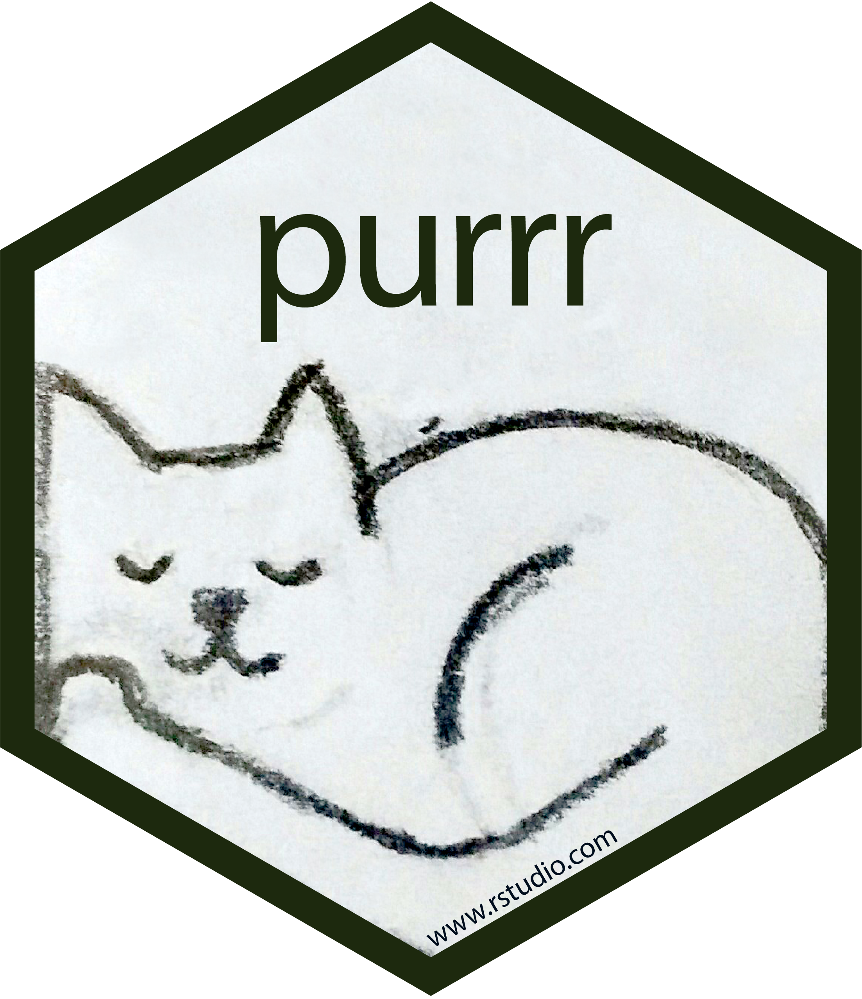

```{r setup}
#| message: false
#| warning: false
#| include: false

library(purrr)
library(dplyr)
library(tidyr)

options(
  width = 80,
  pillar.print_max = 5,
  pillar.print_min = 5
)
```

```{python py_setup}
#| include: false
import warnings
warnings.filterwarnings("ignore", category=DeprecationWarning)

import pandas as pd
import polars as pl

pd.set_option("display.width", 80)
pd.set_option("display.max_rows", 8)
pd.set_option("display.min_rows", 4)
pd.set_option("display.max_colwidth", 24)

pl.Config.set_tbl_rows(5)
pl.Config.set_tbl_cols(6)
pl.Config.set_tbl_width_chars(80)
pl.Config.set_tbl_hide_dtype_separator(True)
```


# Functional programming

## Functions as objects

Functions are first-class objects in both languages - they can be assigned to names, stored in lists and dicts, and passed to other functions.

:::: {.columns .xsmall}
::: {.column width='50%'}
```{r}
f = function(x) x^2
g = f
g(3)
```
```{r}
#| error: true
l = list(sq = f, root = sqrt)
l$sq(3)
l[[2]](9)
l[2](3)
```
:::

::: {.column width='50%'}
```{python}
def f(x):
    return x**2

g = f
g(3)
```
```{python}
import math
d = {"sq": f, "root": math.sqrt}
d["sq"](3)
d["root"](9)
```
:::
::::

::: {.aside}
`l[2](3)` is an error (attempt to apply non-function) since `[` returns a list; use `[[` or `$` to get the function itself.
:::


## Functions as arguments

A function that takes a function as an argument is a higher-order function. Note that the function object is passed (`sum`), not a call to it (`sum()`).

:::: {.columns .xsmall}
::: {.column width='50%'}
```{r}
do_calc = function(v, func) {
  func(v)
}
do_calc(1:3, sum)
do_calc(1:3, mean)
```
:::

::: {.column width='50%'}
```{python}
def do_calc(v, func):
    return func(v)

do_calc([1, 2, 3], sum)
do_calc([1, 2, 3], max)
```
:::
::::

. . .

Many built-in functions work this way,

:::: {.columns .xsmall}
::: {.column width='50%'}
```{r}
integrate(dnorm, -1.96, 1.96)
```
:::

::: {.column width='50%'}
```{python}
sorted(["bb", "a", "ccc"], key=len)
```
:::
::::


## Anonymous functions

Short single-use functions can be written inline without a name: `function(x)` or `\(x)` (v4.1+) in R, `lambda` in Python - a single expression, whose value is returned.

:::: {.columns .small}
::: {.column width='50%'}
```{r}
(\(x) x^2)(4)
```
```{r}
integrate(\(x) sin(x)^2, 0, pi)
```
:::

::: {.column width='50%'}
```{python}
(lambda x: x**2)(4)
```
```{python}
sorted(
  ["Bob", "alice", "Carol"],
  key=lambda s: s.lower()
)
```
:::
::::

::: {.aside}
PEP 8 says not to assign a `lambda` to a name (`sq = lambda x: ...`); write a `def` instead. Both shorthands are meant for functions short enough to read inline.
:::


## Partial application

Partial application fixes some of a function's arguments, producing a new function with a reduced signature. A wrapper does this by hand; `partial()` does it directly, by name or by position.

:::: {.columns .xsmall}
::: {.column width='50%'}
```{r}
pow = function(base, exp) base^exp
cube = partial(pow, exp = 3)
```
```{r}
cube(2)
```
```{r}
partial(pow, 2)(5)
partial(pow, ... = , 3)(2)
```
:::

::: {.column width='50%' .fragment}
```{python}
from functools import partial,  Placeholder
cube = partial(pow, exp=3)
```
```{python}
cube(2)
```
```{python}
partial(pow, 2)(5)
partial(pow, Placeholder, 3)(2)
```
:::
::::

::: {.aside}
Python's `pow(base, exp)` is built in, so it is defined here only in R. Unnamed arguments fill from the left; `... =` in purrr and `Placeholder` in Python 3.14 mark where the rest go.
:::


## Loops vs maps

::: {.medium}
> Of course, someone has to write loops. It doesn't have to be you.
>
> — Jenny Bryan

Most loops compute something per element and collect the results. A map does the looping and collecting, leaving only the computation - generally not faster, just clearer.
:::

:::: {.columns .xsmall}
::: {.column width='50%'}
```{r}
x = c(1, 4, 9)
res = numeric(length(x))
for (i in seq_along(x)) res[i] = sqrt(x[i])
res
```
```{r}
lapply(x, sqrt) |> str()
sapply(x, sqrt) |> str()
```
:::

::: {.column width='50%'}
```{python}
x = [1, 4, 9]
res = []
for v in x:
    res.append(v**0.5)
res
```
```{python}
[v**0.5 for v in x]
list(map(lambda v: v**0.5, x))
```
:::
::::

## `lapply()` and `sapply()`

`lapply(X, FUN, ...)` applies `FUN` to each element of `X` and always returns a list; extra arguments pass through `...`. 

`sapply()` simplifies the result to a vector or matrix when it can (returned type depends on the data).

:::: {.columns .xsmall}
::: {.column width='50%'}
```{r}
lapply(1:3, \(x) x^2) |> str()
```
```{r}
lapply(1:3, \(x, p) x^p, p = 3) |> str()
```
:::

::: {.column width='50%' .fragment}
```{r}
sapply(1:3, \(x) x^2)
sapply(1:3, \(x) c(x, x^2))
```
```{r}
sapply(1:3, seq) |> str()
```
:::
::::

::: {.aside}
Base R also has `vapply()`, `mapply()`, `Map()`, `Filter()`, and `Reduce()`.
:::


# {#purrr-logo data-menu-title="purrr" .nostretch}

{fig-align="center" width="32%"}


## `map()`

`map(.x, .f, ...)` is `lapply()` with a consistent interface. The typed variants `map_lgl()`, `map_int()`, `map_dbl()`, and `map_chr()` return a vector of that type or fail. `walk()` exists for side effects.

:::: {.columns .xsmall}
::: {.column width='50%'}
```{r}
map(1:3, \(x) x^2) |> str()
```
```{r}
map_dbl(1:3, \(x) x^2)
map_chr(1:3, \(x) paste0("n", x))
```
:::

::: {.column width='50%' .fragment}
```{r}
#| error: true
map_chr(1:3, \(x) x^2)
```
```{r}
#| error: true
map_int(1:3, \(x) x / 2)
```
:::
::::

::: {.aside}
Older code uses purrr's formula shorthand, `~ .x^2`, but modern `\(x) x^2` is recommended.
:::


## `map2()`, `pmap()`, and `imap()`

`map2()` iterates over two inputs in parallel, `pmap()` over any number (including the columns of a data frame, row by row), and `imap()` over elements and their names or positions. All have the same typed variants as `map()`.

:::: {.columns .xsmall}
::: {.column width='50%'}
```{r}
map2_chr(letters[1:3], 1:3, paste0)
map2_dbl(1:3, 4:6, \(x, y) x * y)
```
```{r}
pmap_dbl(
  list(1:3, 4:6, 7:9),
  \(x, y, z) x + y + z
)
```
:::

::: {.column width='50%' .fragment}
```{r}
d = tibble(x = 1:2, y = c("a", "b"))
pmap_chr(d, \(x, y) paste(x, y))
```
```{r}
imap_chr(
  c(a = 1, b = 2),
  \(x, i) paste(i, x)
)
```
:::
::::


## Extracting elements

Often `.f` just extracts a piece of each element, so purrr lets a name or position be used directly. `.default` is used when the path does not exist (the result would otherwise be `NULL`).

::: {.xsmall}
```{r}
x = list(list(name = "a", tags = list("x", "y")),
         list(name = "b"),
         list(name = "c", tags = list("z")))
```
:::

:::: {.columns .xsmall}
::: {.column width='50%'}
```{r}
map_chr(x, "name")
map(x, "tags") |> lengths()
```
:::

::: {.column width='50%' .fragment}
```{r}
#| error: true
map_chr(x, list("tags", 1))
```
```{r}
map_chr(
  x, list("tags", 1), .default = NA
)
```
:::
::::

::: {.aside}
Use `list()` rather than `c()` for a path that mixes names and positions, since `c("tags", 1)` coerces the `1` to `"1"`.
:::


## `keep()` and `discard()`

`keep()` and `discard()` filter a vector or list by a predicate function, returning the elements where it is `TRUE` or `FALSE` respectively. The predicate takes the same forms as `.f` in `map()`, including the name shorthand.

:::: {.columns .xsmall}
::: {.column width='50%'}
```{r}
keep(1:10, \(x) x %% 3 == 0)
discard(1:10, \(x) x %% 3 == 0)
```
:::

::: {.column width='50%' .fragment}
```{r}
x |>
  keep(\(e) "tags" %in% names(e)) |>
  map_chr("name")
```
:::
::::


## `reduce()` and `accumulate()`

`reduce()` collapses a list to one value by applying a two-argument function cumulatively, `f(f(f(x1, x2), x3), x4)`; `accumulate()` does the same but keeps the intermediate results.

:::: {.columns .xsmall}
::: {.column width='50%'}
```{r}
reduce(1:5, `+`)
accumulate(1:5, `+`)
```
```{r}
x = list(1:3, 2:4, 3:5)
reduce(x, intersect)
```
:::

::: {.column width='50%' .fragment}
```{r}
dfs = list(
  tibble(id = 1:2, a = 1:2),
  tibble(id = 1:2, b = 3:4),
  tibble(id = 1:2, c = 5:6)
)
reduce(dfs, left_join, by = "id")
```
:::
::::

::: {.aside}
To stack a list of data frames by row use `list_rbind()` (`pd.concat()` or `pl.concat()` in Python), not `reduce()` with `bind_rows()`.
:::


# Functional tools<br/>in Python

## `map()` and `filter()`

Python's built-in `map(f, iterable)` and `filter(pred, iterable)` are the analogs of purrr's `map()` and `keep()`. Both return lazy iterators - nothing is computed until the values are consumed (`list()`, a `for` loop, `sum()`, ...) and they can be consumed only once.

:::: {.columns .xsmall}
::: {.column width='50%'}
```{python}
m = map(lambda x: x**2, range(5))
m
list(m)
list(m)
```
:::

::: {.column width='50%' .fragment}
```{python}
list(filter(
  lambda x: x % 2 == 0, range(10)
))
```
```{python}
list(map(pow, [1, 2, 3], [4, 5, 6]))
```
:::
::::

::: {.aside}
`map()` with several iterables is the analog of `map2()` / `pmap()`. There are no typed variants - a list can hold anything, so checking the result type is up to you.
:::


## Comprehensions

Python style prefers a comprehension to `map()` and `filter()` - transformation and filter in one expression, no `lambda`. The same syntax builds dicts and sets, and in parentheses a generator (next slide), which `sum()` and `any()` consume below.

:::: {.columns .xsmall}
::: {.column width='50%'}
```{python}
[x**2 for x in range(5)]
[x**2 for x in range(10) if x % 2 == 0]
```
```{python}
[a + b for a, b in zip("ab", "cd")]
```
:::

::: {.column width='50%' .fragment}
```{python}
{x: x**2 for x in range(4)}
{x % 3 for x in range(10)}
```
```{python}
sum(x**2 for x in range(5))
any(x > 3 for x in range(5))
```
:::
::::


## Generators

A generator function uses `yield` instead of `return`. Calling it runs nothing; it returns a generator that produces one value each time it is asked, pausing after each `yield`. A generator expression, `(f(x) for x in xs)`, is the one-line form.

:::: {.columns .xsmall}
::: {.column width='50%'}
```{python}
def countdown(n):
    while n > 0:
        yield n
        n -= 1
```
```{python}
g = countdown(3)
type(g)
```
```{python}
next(g)
next(g)
```
:::

::: {.column width='50%' .fragment}
```{python}
#| error: true
next(g)
next(g)
```
```{python}
list(countdown(3))
[x**2 for x in countdown(3)]
```
:::
::::

::: {.aside}
`for`, `list()`, and `sum()` call `next()` until `StopIteration`; `next(g, default)` returns `default` instead.
:::


## Laziness

Creating a generator does no work; each `next()` runs it only as far as the following `yield`. So a generator can be infinite, stop early, or read a file one line at a time, and chained generators form a pipeline.

:::: {.columns .xsmall}
::: {.column width='50%'}
```{python}
def loud(xs):
    for x in xs:
        print("yielding", x)
        yield x

g = loud([1, 2, 3])
```
```{python}
next(g)
list(g)
```
:::

::: {.column width='50%' .fragment}
```{python}
def naturals():
    n = 1
    while True:
        yield n
        n += 1
```
```{python}
from itertools import islice
squares = (n**2 for n in naturals())
list(islice(squares, 5))
next(s for s in squares if s > 1000)
```
:::
::::

::: {.aside}
Base R has no generators (vectors are eager, functions cannot pause).
:::


## `reduce()` and friends

Reductions live in the standard library - `functools.reduce()` for a general fold, `itertools.accumulate()` for the running version, and `sum()`, `min()`, `max()`, `any()`, `all()` for common cases. `operator` has function versions of the operators.

:::: {.columns .xsmall}
::: {.column width='50%'}
```{python}
from functools import reduce
from itertools import accumulate
import operator
```
```{python}
reduce(operator.add, range(1, 6))
list(accumulate(range(1, 6)))
```
:::

::: {.column width='50%' .fragment}
```{python}
reduce(
  lambda a, b: a + b,
  [[1, 2], [3], [4, 5]]
)
```
```{python}
list(accumulate([1, 3, 2, 5, 4], max))
```
:::
::::

::: {.aside}
`operator.itemgetter("name")` is a function that does `x["name"]`, the closest thing to purrr's `map(x, "name")`.
:::


# Rectangling

## GitHub repositories

The GitHub API's [`/orgs/{org}/repos`](https://docs.github.com/en/rest/repos/repos#list-organization-repositories) endpoint lists an organization's repositories as an array of objects, one per repository, each with the same 83 fields (abridged here):

::: {.xsmall}
```json
[
  {
    "id": 19438,
    "name": "ggplot2",
    "owner": { "login": "tidyverse", "type": "Organization", ... },
    "stargazers_count": 7002,
    "language": "R",
    "license": { "key": "other", "name": "Other", ... },
    "topics": ["data-visualisation", "r", "visualisation"],
    ...
  },
  ...
  {
    "name": "nycflights13",
    "license": null,
    "topics": [],
    ...
  },
  ...
]
```
:::


## Reading JSON

```{r fetch_repos}
#| include: false
if (!file.exists("data/tidyverse_repos.json")) {
  readLines("https://api.github.com/orgs/tidyverse/repos?per_page=100") |>
    writeLines("data/tidyverse_repos.json")
}
```

`jsonlite::read_json()` and Python's `json.load()` keep the structure as is: the array becomes a list, each object a named list (R) or dict (Python) with nested objects staying nested.

:::: {.columns .xsmall}
::: {.column width='50%'}
```{r}
repos = jsonlite::read_json(
  "data/tidyverse_repos.json"
)
```
:::

::: {.column width='50%'}
```{python}
import json
path = "data/tidyverse_repos.json"
with open(path) as f:
    repos = json.load(f)
```
:::
::::

:::: {.columns .xsmall}
::: {.column width='50%'}
```{r}
length(repos)
repos[[1]]$name
repos[[1]]$license$name
```
:::

::: {.column width='50%'}
```{python}
len(repos)
repos[0]["name"]
repos[0]["license"]["name"]
```
:::
::::


## Extracting columns - purrr

A tidy version has one row per repository and one column per variable. The direct approach builds each column with a `map_*()`.

::: {.small}
```{r}
tibble(
  name     = map_chr(repos, "name"),
  stars    = map_int(repos, "stargazers_count"),
  n_topics = map_int(repos, \(r) length(r$topics))
)
```
:::


## Extracting columns - Python

The same idea with one comprehension per column. `pd.DataFrame()` and `pl.DataFrame()` accept a dict of lists like this, or a list of dicts, one per row.

::: {.small}
```{python}
pd.DataFrame({
  "name":     [r["name"] for r in repos],
  "stars":    [r["stargazers_count"] for r in repos],
  "n_topics": [len(r["topics"]) for r in repos]
})
```
:::


## Missing values

Some repositories have no license, so `license` is `NULL` in R and `None` in Python. 

`NULL` cannot fill a vector slot, so `map_chr()` fails without `.default`. `None` is an okay list element, but indexing into it fails. A conditional expression gives the name when there is a license and `None` otherwise.

::: {.xsmall}
```{r}
#| error: true
map_chr(repos, c("license", "name"))
```
```{python}
#| error: true
[r["license"]["name"] for r in repos]
```
:::

:::: {.columns .xsmall}
::: {.column width='50%' .fragment}
```{r}
license = map_chr(
  repos, c("license", "name"),
  .default = NA
)
license[7:9]
```
:::

::: {.column width='50%' .fragment}
```{python}
license = [
  r["license"]["name"] if r["license"] else None
  for r in repos
]
license[6:9]
```
:::
::::


## Exercise 1

Using `repos` (the tidyverse GitHub repositories) with purrr in R and comprehensions in Python,

1. Construct a data frame with two columns: each repository's `name` and its primary `language`.

2. Find the five repositories with the most stars (`stargazers_count`).

3. Find the names of the repositories with `"r"` among their `topics`.


## List columns

The other approach puts the whole list into a data frame first and takes it apart from there. A list column holds an arbitrary object per cell; polars infers a `Struct` (named fields) for dicts and a `List` for lists, pandas stores either as `object`.

:::: {.columns .xxsmall}
::: {.column width='50%'}
```{r}
(d = tibble(repo = repos))
```
```{python}
print(pd.DataFrame({"repo": repos}))
```
:::

::: {.column width='50%'}
```{python}
print(pl.DataFrame({"repo": repos}))
```
:::
::::


## `unnest_wider()`

`unnest_wider()` makes each element of the named lists its own column - for list columns where every element has the same names. Types are inferred from the values, `NULL` becomes `NA`, and a nested object stays as a list column.

::: {.mxsmall}
```{r}
d |> unnest_wider(repo)
```
:::

::: {.aside}
Most of the 83 columns are API URLs that will never be used - `select()` the ones that matter, or see `hoist()` below.
:::


## Nested objects

`license` is a list column of named lists (or `NULL`), so a second `unnest_wider()` spreads it. `names_sep` adds a prefix, since the license's `name` and `url` would collide with the repository's; the `NULL`s become rows of `NA`.

::: {.mxsmall}
```{r}
(lic = d |> unnest_wider(repo) |> select(name, license) |> slice(7:9))
```
```{r}
lic |>
  unnest_wider(license, names_sep = "_")
```

:::


## pandas - `json_normalize()`

::: {.medium}
pandas has no `unnest_wider()`, but the same workflow is three steps: `pd.json_normalize()` spreads the dicts in a column into a data frame (`max_level=0` leaves nested dicts as they are), `join()` attaches those columns, and `drop()` removes the original.
:::

::: {.xsmall}
```{python}
df = pd.DataFrame({"repo": repos})
wide = (
  df
  .join(pd.json_normalize(df["repo"], max_level=0))
  .drop(columns="repo")
)
wide[["name", "language", "license"]]
```
:::

::: {.aside}
`pd.DataFrame(repos)` and `pl.DataFrame(repos)` build this wide frame from the list of dicts in one step; the workflow above is for dicts already sitting in a column.
:::


## pandas - nested objects

`license` is a column of dicts (or `None`), so the same three steps spread it: `json_normalize()` the column, `add_prefix()` in place of `names_sep` so the license's `name` and `url` do not collide with the repository's, then `join()` and `drop()`. The `None`s become rows of `NaN`.

::: {.mxsmall}
```{python}
lic = wide[["name", "license"]]
lic.iloc[6:9]
```
```{python}
lic_wide = (lic
  .join(pd.json_normalize(lic["license"]).add_prefix("license_"))
  .drop(columns="license")
)
print(lic_wide.iloc[6:9].to_string())
```
:::


## polars - `unnest()`

polars' `unnest()` is `unnest_wider()` for a `Struct` column: one call spreads the fields of `repo` into the 83 columns, and the nested `license` is itself a struct (or `null`).

::: {.xsmall}
```{python}
repos_pl = pl.DataFrame({"repo": repos}).unnest("repo")
repos_pl.select("name", "language", "license")
```
:::


## polars - nested objects

`unnest()` errors on name collisions (`name`, `url`, ...), so prefix the struct's fields first. `struct.field()` extracts a single field instead, renamed with `alias()` here since the repository already has a `name` column. `pl.json_normalize()` flattens nested dicts like the pandas function.

:::: {.columns .xsmall}
::: {.column width='50%'}
```{python}
repos_pl.with_columns(
  pl.col("license")
    .name.prefix_fields("license_")
).unnest(
  "license"
).select(
  "name", "license_name"
)
```
:::

::: {.column width='50%' .fragment}
```{python}
repos_pl.select(
  "name",
  pl.col("license")
    .struct.field("name")
    .alias("license")
)
```
:::
::::


## `unnest_longer()` and `explode()`

When an element is an array of values, the tidy shape is one row per value: `unnest_longer()` in tidyr, `explode()` in pandas and polars. Each repository has zero or more `topics`,

:::: {.columns .xxsmall}
::: {.column width='33%'}
```{r}
d |>
  unnest_wider(repo) |>
  select(name, topics) |>
  unnest_longer(topics)
```
:::

::: {.column width='33%' .fragment}
```{python}
(wide[["name", "topics"]]
  .explode("topics")
)
```
:::

::: {.column width='33%' .fragment}
```{python}
(repos_pl
  .select("name", "topics")
  .explode("topics")
)
```
:::
::::

::: {.aside}
16 repositories have no topics - tidyr drops them unless `keep_empty = TRUE`, pandas keeps as `NaN`s, and polars' uses `empty_as_null` arg (default changing to `False` in Polars 2.0).
:::


## `hoist()`

`hoist()` pulls a few fields out of a list column by name, position, or path (`NA` when missing) and leaves the rest. Effective when we don't want all the columns from unnesting.

:::: {.columns .xsmall}
::: {.column width='50%'}
```{r}
tibble(repo = repos) |>
  hoist(
    repo, name = "name",
    license = c("license", "name"),
    first_topic = list("topics", 1)
  )
```
:::

::: {.column width='50%' .fragment}
```{python}
def at(x, i):
    return x[i] if x else None
pd.DataFrame([{
  "name": r["name"],
  "license": at(r["license"], "name"),
  "first_topic": at(r["topics"], 0)
} for r in repos])
```
:::
::::

::: {.aside}
Not in Python so we're stuck with the comprehension approach.
:::


## General advice

* Same-named entries in every element: go wider with `unnest_wider()`, `pd.json_normalize()`, or polars' `unnest()`.

* Arrays of varying length: go longer with `unnest_longer()` or `explode()`.

* Avoid tidyr's plain `unnest()`, which expects a list column of data frames, and `unnest_auto()`, which guesses between wider and longer from the data.

* Do not rectangle what you will not use - `hoist()`, `map_*()`, and comprehensions target just the fields you need.

* Check the column types afterwards - a list (or `object`) column usually means inconsistent values: a scalar in some records, an array or missing in others.


## Exercise 2

Most of the 83 fields are API URLs that you will never use. Using tidyr / purrr in R and pandas or polars in Python, tidy `repos` into a data frame with one row per repository and just the useful fields: `name`, `description`, `language`, `stargazers_count`, `forks_count`, the license name (missing where there is no license), and the number of topics. Check the column types when you are done.


# Summary

## Functional tools

::: {.small}
| Concept              | R                                    | Python                                             |
|:---------------------|:-------------------------------------|:---------------------------------------------------|
| anonymous function   | `\(x) x^2`, `function(x) x^2`        | `lambda x: x**2`                                   |
| apply to each        | `map(x, f)`, `lapply(x, f)`          | `[f(v) for v in x]`, `map(f, x)`                   |
| typed result         | `map_dbl()`, `map_chr()`, ...        | none, check it yourself                            |
| two or more inputs   | `map2()`, `pmap()`                   | `zip()`, `map(f, a, b)`                            |
| index and value      | `imap()`                             | `enumerate()`                                      |
| filter               | `keep()`, `discard()`                | `[v for v in x if p(v)]`, `filter()`               |
| reduce               | `reduce()`, `accumulate()`           | `functools.reduce()`, `itertools.accumulate()`     |
| extract by name      | `map(x, "name")`                     | `[d["name"] for d in x]`, `operator.itemgetter()`  |
| missing element      | `.default =`                         | `x["k"] if x else None`, `d.get("k")` for a missing key |
| side effects         | `walk()`                             | `for` loop                                         |
| partial application  | `partial(f, p = 3)`, `...` in `map()` | `functools.partial(f, p=3)`                       |
| lazy sequence        | none, vectors are eager              | generator (`yield`), `map()`, `zip()`              |
:::


## Rectangling

::: {.small}
| Task                 | tidyr / purrr                        | pandas                              | polars                            |
|:---------------------|:-------------------------------------|:------------------------------------|:----------------------------------|
| read JSON            | `jsonlite::read_json()`              | `json.load()`                       | `json.load()`                     |
| list column          | `tibble(x = lst)`                    | `pd.DataFrame({"x": lst})`, `object` | `pl.DataFrame({"x": lst})`, `Struct` |
| object to columns    | `unnest_wider()`                     | `pd.json_normalize()`               | `unnest()`, `pl.json_normalize()` |
| array to rows        | `unnest_longer()`                    | `explode()`                         | `explode()`                       |
| a few fields         | `hoist()`, `map_chr(x, c("a", "b"))` | `[d["a"]["b"] for d in x]`          | `struct.field()`                  |
| missing values       | `NULL`, `NA` after unnesting         | `None`, `NaN`                       | `null`                            |
:::


## Takeaways

::: {.medium}
* Functions are values in both languages - pass them to other functions, store them, fix some of their arguments with `partial()`, and write short ones inline with `\(x)` or `lambda`.

* purrr's `map_*()` family replaces `lapply()` / `sapply()` with type-stable iteration, plus shorthands for extraction, multiple inputs, filtering, and reducing. Python has `map()`, `filter()`, `functools.reduce()`, and lazy generators, but a comprehension is the idiom.

* JSON becomes nested lists (R) or dicts and lists (Python). Rectangling is extracting fields and unnesting - wider for objects, longer for arrays - until each row is an observation and each column a variable.

* Prefer targeted extraction (`map_*()`, `hoist()`, a comprehension) over unnesting everything, and check the column types when you are done.
:::


# Example

<br/>

::: {.xlarge}
Rectangling `data/discog.json`
:::
