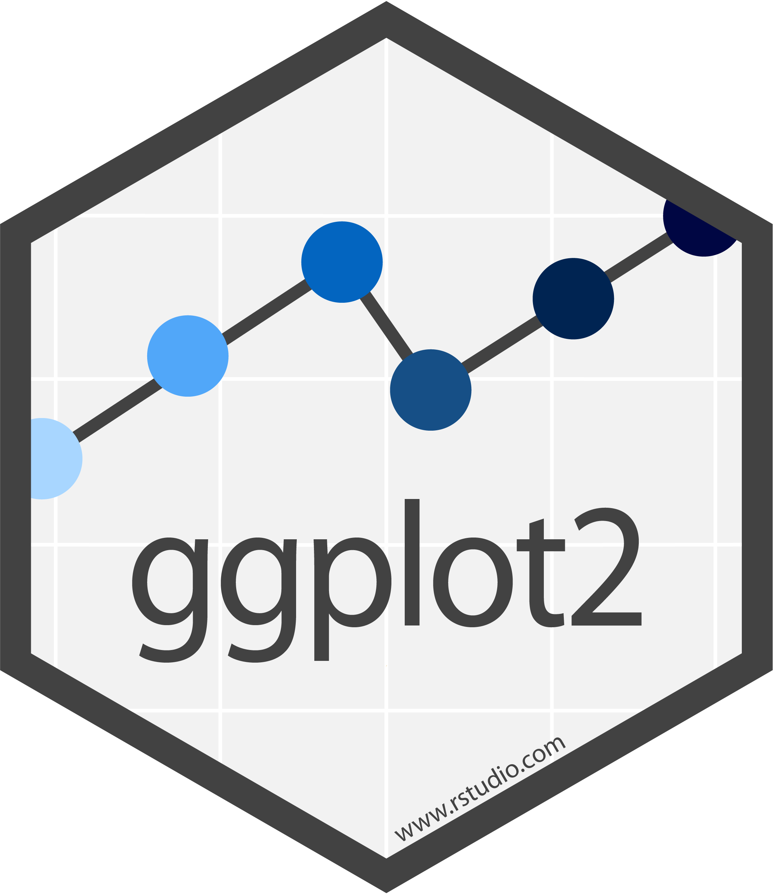
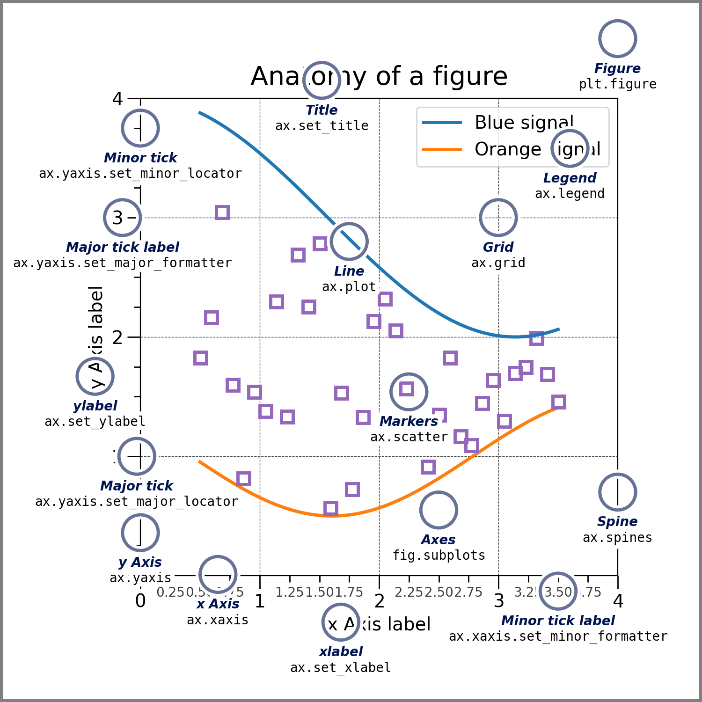
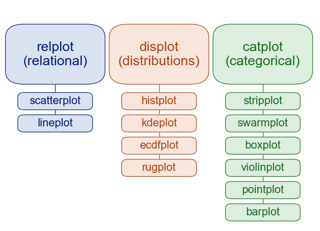

```{r setup}
#| message: false
#| warning: false
#| include: false

library(ggplot2)

options(
  width = 80,
  pillar.print_max = 5,
  pillar.print_min = 5
)

knitr::opts_chunk$set(
  fig.align = "center", fig.retina = 2, dpi = 150,
  fig.width = 6, fig.height = 3.75, out.width = "100%"
)
```

```{python py_setup}
#| include: false
import warnings
warnings.filterwarnings("ignore", category=DeprecationWarning)
warnings.filterwarnings("ignore", category=FutureWarning)

import pandas as pd
import matplotlib.pyplot as plt

pd.set_option("display.width", 80)
pd.set_option("display.max_rows", 8)
pd.set_option("display.min_rows", 4)

plt.rcParams["figure.figsize"] = (6, 3.75)
plt.rcParams["savefig.bbox"] = "tight"
```


# Grammar of graphics

## The Grammar of Graphics

- Conceptualized by Leland Wilkinson in The Grammar of Graphics (1999)

- An attempt to taxonomize the basic elements of statistical graphics - what a plot is made of, independent of any particular chart type

- Adapted for R by Hadley Wickham as ggplot2 (2007)
  - a consistent and compact syntax for describing statistical graphics
  - highly modular - a plot is assembled from semantic components rather than picked from a menu of chart types
  - opinionated about how a plot is described, not about which plot to make

- The same ideas underlie plotnine (a port of ggplot2 to Python) and seaborn's `objects` interface (end of the lecture)


## Components of a plot

::: {.medium}
A statistical graphic is a mapping of data variables to aesthetic attributes (position, color, size, shape, ...) of geometric objects (points, lines, bars, ...), possibly after a statistical transformation, drawn in a coordinate system and possibly split into facets.
:::

::: {.small}
| Component   | Role                                                              | ggplot2                |
|:------------|:------------------------------------------------------------------|:-----------------------|
| data        | the data frame being plotted                                      | `ggplot(data)`         |
| aesthetics  | which variables map to which visual properties                    | `aes()`                |
| geometries  | the visual objects that represent the data                        | `geom_*()`             |
| statistics  | transformations applied before drawing (counts, bins, model fits) | `stat_*()`             |
| scales      | how data values become aesthetic values (palettes, breaks, log)   | `scale_*()`            |
| facets      | splitting the data into small multiples                           | `facet_*()`            |
| coordinates | the coordinate system (Cartesian, flipped, polar, map)  | `coord_*()`            |
| theme       | everything that is not data (fonts, gridlines, backgrounds)       | `theme_*()`, `theme()` |
:::


# {#ggplot2-logo data-menu-title="ggplot2" .nostretch}

{fig-align="center" width="32%"}


## Layers

::: {.medium}
A ggplot2 plot is a stack of layers drawn on shared scales, facets, and coordinates, with a theme on top. Each layer combines data and an aesthetic mapping with a geom, a stat, and a position adjustment.
:::

:::: {.xsmall}
<br/>
```r
ggplot(
  data = [data frame],
  mapping = aes(x = , y = , ...)
) +
  geom_[type](
    aes(...), stat = , position =
  ) +
  geom_[type](...) +
  scale_[aes]_[type]() +
  facet_[type]() +
  coord_[type]() +
  theme_[name]()
```
:::


## Data - Palmer penguins

:::: {.columns .xsmall}
::: {.column width='50%'}
```{r}
#| message: false
library(palmerpenguins)
(penguins = tidyr::drop_na(penguins))
```
:::

::: {.column width='50%'}
```{python}
penguins = pd.read_csv(
  "data/penguins.csv"
).dropna()
penguins
```
:::
::::

::: {.aside}
Rows with missing values are dropped so the examples avoid ggplot2's "Removed n rows" warnings; `na.rm = TRUE` in a layer silences them for that layer.
:::


## Data and mapping

`ggplot()` sets the default data and aesthetic mapping for every layer that follows. With no layers there is nothing to draw, but the `x` and `y` scales already exist.

::: {.xsmall}
```{r}
#| output-location: column
ggplot(
  penguins,
  aes(
    x = bill_depth_mm,
    y = bill_length_mm
  )
)
```
:::


## Adding a layer

`geom_point()` adds a layer with `+`. It inherits the data and mapping from `ggplot()`, applies its default stat (`"identity"`, which leaves the data alone), and draws one point per row.

::: {.xsmall}
```{r}
#| output-location: column
#| code-line-numbers: "8"
ggplot(
  penguins,
  aes(
    x = bill_depth_mm,
    y = bill_length_mm
  )
) +
  geom_point()
```
:::


## A second layer

`geom_smooth()` is a layer whose stat fits a model before drawing. The `color` mapping was given to `geom_point()` only, so the smooth layer knows nothing about species and fits one line to everything.

::: {.xsmall}
```{r}
#| output-location: column
#| code-line-numbers: "8-9"
#| message: false
ggplot(
  penguins,
  aes(
    x = bill_depth_mm,
    y = bill_length_mm
  )
) +
  geom_point(aes(color = species)) +
  geom_smooth(method = "lm")
```
:::


## Inherited aesthetics

If we move `color = species` from `geom_point()` into `ggplot()`, how many regression lines will be fitted?

:::: {.columns}
::: {.column width='50%' .xsmall}
```{r inherited-aesthetics-code}
#| eval: false
#| code-line-numbers: "6"
ggplot(
  penguins,
  aes(
    x = bill_depth_mm,
    y = bill_length_mm,
    color = species
  )
) +
  geom_point() +
  geom_smooth(method = "lm")
```
:::

::: {.column width='50%' .fragment .small}
```{r, ref.label="inherited-aesthetics-code"}
#| echo: false
#| eval: true
#| message: false
```
:::
::::

. . .

Moving the mapping into `ggplot()` makes it part of every layer. Each layer's stat is computed per group, so there is now one fit per species and the overall negative trend reverses within each (Simpson's paradox).


## Scales, facets, and theme

Scales, facets, labels, and the theme are not layers. They are also added with `+`, but each applies to the whole plot.

::: {.xsmall}
```{r}
#| output-location: column
#| code-line-numbers: "11-18"
#| message: false
ggplot(
  penguins,
  aes(
    x = bill_depth_mm,
    y = bill_length_mm,
    color = species
  )
) +
  geom_point() +
  geom_smooth(method = "lm") +
  facet_wrap(~ island) +
  scale_color_viridis_d() +
  labs(
    x = "Bill depth (mm)",
    y = "Bill length (mm)",
    color = "Species"
  ) +
  theme_minimal()
```
:::


## Mapping vs setting

::: {.medium}
Anything inside `aes()` is a mapping: the aesthetic varies with a variable in the data and gets a scale and a legend. 

Anything outside `aes()` is a setting: a constant applied to the whole layer.
:::

::: {.mxsmall}
```{r}
p = ggplot(penguins, aes(x = bill_depth_mm, y = bill_length_mm))
```
:::

:::: {.columns .mxsmall}
::: {.column width='33%'}
```{r}
p + geom_point(
  aes(color = species)
)
```
:::

::: {.column width='33%'}
```{r}
p + geom_point(
  color = "darkorange"
)
```
:::

::: {.column width='33%'}
```{r}
p + geom_point(
  aes(color = "darkorange")
)
```
:::
::::

::: {.aside}
The last plot is a common mistake: inside `aes()` the string is data, so it is mapped to the first color of the default palette and given a legend entry named `darkorange`.
:::


## ggplot objects

::: {.medium}
`ggplot()` returns an object describing the plot; nothing is drawn until it is printed. So a plot can be assigned, extended with `+`, stored in a list, returned from a function, or written to a file with `ggsave()`.
:::

:::: {.columns .mxsmall}
::: {.column width='50%'}
```{r}
p = ggplot(
  penguins,
  aes(
    x = flipper_length_mm,
    y = body_mass_g
  )
) +
  geom_point()
```
```{r}
class(p)[1]
length(p@layers)
```
:::

::: {.column width='50%' .fragment}
```{r}
#| eval: false
ggsave(
  "penguins.png", p,
  width = 6, height = 4
)
```
```{r}
#| out-width: 80%
#| message: false
p + geom_smooth(method = "lm") +
  theme_bw()
```
:::
::::

::: {.aside}
As of ggplot2 4.0, plots are S7 objects (S7 is R's newest OOP system, successor to S3 and S4), so their components are properties accessed with `@`, e.g. `p@layers` or `p@data`.
:::


## The rest of ggplot2

::: {.medium}
We will not tour the geoms. The [reference index](https://ggplot2.tidyverse.org/reference/) is organized by the components above (layers, scales, guides, facets, coordinates, themes) and is the place to find what exists and which aesthetics each one understands.
:::

<iframe data-src="https://ggplot2.tidyverse.org/reference/index.html" width="100%" height="400px" style="border:1px solid;border-radius: 5px;" data-external="1">
</iframe>

::: {.aside}
See also the [ggplot2 book](https://ggplot2-book.org/), [R4DS](https://r4ds.hadley.nz/visualize.html), the [cheatsheet](https://rstudio.github.io/cheatsheets/html/data-visualization.html), and the [extension gallery](https://exts.ggplot2.tidyverse.org/gallery/).
:::


# matplotlib

## matplotlib & pyplot

> Matplotlib is a comprehensive library for creating static, animated, and interactive visualizations in Python.

> `matplotlib.pyplot` is a collection of functions that make matplotlib work like MATLAB. Each `pyplot` function makes some change to a figure: e.g., creates a figure, creates a plotting area in a figure, plots some lines in a plotting area, decorates the plot with labels, etc.

::: {.small}
```{python}
import matplotlib as mpl
import matplotlib.pyplot as plt
```
:::

::: {.medium}
seaborn, plotnine, and pandas' default plotting backend draw with matplotlib, so its objects and vocabulary show up even when it is never called directly.
:::


## Anatomy of a figure

:::: {.columns}
::: {.column width='50%'}
{fig-align="center" width="90%"}
:::

::: {.column width='50%' .medium}
- Figure: the whole canvas, holding one or more Axes plus figure-wide titles and legends

- Axes: one plot (a panel or subplot), the data region together with its x and y Axis, title, labels, and legend. Nearly all plotting methods live here.

- Axis: a single number line (`ax.xaxis`, `ax.yaxis`) with its limits, ticks, and tick labels

- Artist: everything visible, including the three above and every line, marker, patch, and text they contain
:::
::::

::: {.aside}
Axes (the panel) and axis (the number line) are different things, which is the most confusing naming in the library.
:::


## Two interfaces

:::: {.columns}
::: {.column width='50%'}

Implicit (pyplot):

::: {.xsmall}
```{python}
#| out-width: 70%
plt.figure(figsize=(5, 3))
plt.scatter(
  "bill_depth_mm", "bill_length_mm",
  data=penguins, s=10
)
plt.xlabel("Bill depth (mm)")
plt.ylabel("Bill length (mm)")
plt.title("Palmer penguins")
```
:::
:::

::: {.column width='50%'}

Explicit (object-oriented):

::: {.xsmall}
```{python}
#| out-width: 70%
fig, ax = plt.subplots(figsize=(5, 3))
ax.scatter(
  "bill_depth_mm", "bill_length_mm",
  data=penguins, s=10
)
ax.set_xlabel("Bill depth (mm)")
ax.set_ylabel("Bill length (mm)")
ax.set_title("Palmer penguins")
```
:::
:::
::::

::: {.aside}
The OO approach is generally preferred.
:::


## Subplots (OO)

`plt.subplots(nrows, ncols)` returns a Figure and either a single `Axes` (one panel), a 1D array of Axes (one row or column), or a 2D array of Axes (multiple rows and columns). Each panel is drawn and labeled through its own object; the figure-wide title belongs to the Figure.

::: {.xsmall}
```{python}
#| output-location: column
fig, axs = plt.subplots(
  1, 2, figsize=(7, 3),
  layout="constrained"
)
axs[0].hist(
  penguins["body_mass_g"], bins=20
)
axs[0].set_title("Body mass (g)")

axs[1].scatter(
  "flipper_length_mm", "body_mass_g",
  data=penguins, s=8
)
axs[1].set(
  xlabel="Flipper length (mm)",
  ylabel="Body mass (g)"
)
fig.suptitle("Palmer penguins")
```
:::


## Subplots (implicit)

`plt.subplot(nrows, ncols, index)` adds the panel at `index` (counting from 1, by row) and makes it the current Axes; subsequent `plt.*` calls draw into whichever panel was selected last.

::: {.xsmall}
```{python}
#| output-location: column
plt.figure(
  figsize=(5, 5), layout="constrained"
)
plt.subplot(2, 1, 1)
plt.hist(
  penguins["body_mass_g"], bins=20
)
plt.title("Body mass (g)")

plt.subplot(2, 1, 2)
plt.scatter(
  "flipper_length_mm", "body_mass_g",
  data=penguins, s=8
)
plt.xlabel("Flipper length (mm)")
plt.ylabel("Body mass (g)")
plt.suptitle("Palmer penguins")
```
:::


## Grouping by hand

::: {.medium}
matplotlib draws what it is told: `ax.scatter()` takes arrays and either a single color or numeric values run through a colormap (`c=`, `cmap=`). There is no notion of mapping a categorical variable to color, so coloring by species means splitting the data, drawing each subset with a `label`, and asking for a legend. Every additional variable (shape by sex, one panel per island) is another loop.
:::

::: {.xsmall}
```{python}
#| output-location: column
fig, ax = plt.subplots(figsize=(5, 3.5))
for s, d in penguins.groupby("species"):
    ax.scatter(
      "bill_depth_mm", "bill_length_mm",
      data=d, label=s, s=10
    )
ax.set_xlabel("Bill depth (mm)")
ax.set_ylabel("Bill length (mm)")
ax.legend(title="Species")
```
:::


# seaborn

## seaborn

> Seaborn is a library for making statistical graphics in Python. It builds on top of matplotlib and integrates closely with pandas data structures. ... Its plotting functions operate on dataframes and arrays containing whole datasets and internally perform the necessary semantic mapping and statistical aggregation to produce informative plots. Its dataset-oriented, declarative API lets you focus on what the different elements of your plots mean, rather than on the details of how to draw them.

::: {.small}
```{python}
import seaborn as sns
sns.set_theme()
```
:::


::: {.aside}
`sns.set_theme()` applies seaborn's default style, context, and palette to every subsequent matplotlib figure.
:::


## Semantic mappings

::: {.medium}
`hue` is seaborn's name for a color mapping, the equivalent of ggplot2's `color` aesthetic.
:::

::: {.xsmall}
```{python}
#| out-width: 50%
sns.scatterplot(
  data=penguins,
  x="bill_depth_mm",
  y="bill_length_mm",
  hue="species"
)
```
:::


## Figure-level vs axes-level functions

::: {.medium}
seaborn's plotting functions come in two flavors:

- axes-level functions (`scatterplot()`, `histplot()`, `boxplot()`, ...) draw onto a single matplotlib `Axes` and return it, so they behave like `ax.scatter()` with mappings and stats added.

- figure-level functions (`relplot()`, `displot()`, `catplot()`) create their own `Figure`, axes-level function are choosen via `kind=`, faceting via `col=` and `row=`, with a legend placed outside, and return a `FacetGrid`.
:::

{fig-align="center" width="45%"}


## Statistical estimation

::: {.medium}
Like ggplot2's stats, seaborn's functions summarize before drawing: `lineplot()`, `barplot()`, and `pointplot()` show a mean with a 95% bootstrap CI (`estimator=`, `errorbar=`), `histplot()` and `kdeplot()` bin or smooth, and `regplot()` fits and draws a regression (`order=`, `logistic=`, `lowess=`).
:::

:::: {.columns .xsmall}
::: {.column width='50%'}
```{python}
#| out-width: 75%
g = sns.catplot(
  data=penguins, x="sex",
  y="body_mass_g", hue="species",
  kind="point", height=5, aspect=1.2
)
```
:::

::: {.column width='50%'}
```{python}
#| out-width: 75%
g = sns.lmplot(
  data=penguins, x="bill_depth_mm",
  y="bill_length_mm", hue="species",
  height=5, aspect=1.2
)
```
:::
::::


## `relplot()`

::: {.medium}
`relplot()` shows the relationship between two numeric variables, with `kind="scatter"` (the default) or `kind="line"`.
:::

:::: {.columns .xsmall}
::: {.column width='50%'}
```{python}
#| out-width: 75%
g = sns.relplot(
  data=penguins, x="bill_depth_mm",
  y="bill_length_mm", hue="species",
  style="sex", height=5, aspect=1.2
)
```
:::

::: {.column width='50%'}
```{python}
#| out-width: 75%
g = sns.relplot(
  data=penguins, x="bill_depth_mm",
  y="bill_length_mm", hue="species",
  kind="line", height=5, aspect=1.2
)
```
:::
::::

::: {.aside}
Note that this line plot is nonsense and means nothing.
:::

## `displot()`

::: {.medium}
`displot()` shows the distribution of a numeric variable, with `kind="hist"` (the default), `"kde"`, or `"ecdf"`.
:::

:::: {.columns .xsmall}
::: {.column width='50%'}
```{python}
#| out-width: 75%
g = sns.displot(
  data=penguins, x="body_mass_g",
  hue="species",
  height=5, aspect=1.2
)
```
:::

::: {.column width='50%'}
```{python}
#| out-width: 75%
g = sns.displot(
  data=penguins, x="body_mass_g",
  hue="species", kind="kde", fill=True,
  common_norm=False,
  height=5, aspect=1.2
)
```
:::
::::


::: {.aside}
With `hue`, seaborn defaults to scaling density areas by group size. Use `common_norm=False` to normalize each group independently, as ggplot2 does.
:::


## `catplot()`

::: {.medium}
`catplot()` shows data grouped by the levels of a categorical variable, with `kind="strip"` (the default), `"box"`, `"violin"`, `"bar"`, and others.
:::

:::: {.columns .xsmall}
::: {.column width='50%'}
```{python}
#| out-width: 75%
g = sns.catplot(
  data=penguins, x="species",
  y="body_mass_g", hue="sex",
  kind="box", height=5, aspect=1.2
)
```
:::

::: {.column width='50%'}
```{python}
#| out-width: 75%
g = sns.catplot(
  data=penguins, x="species",
  y="body_mass_g", hue="sex",
  kind="bar", height=5, aspect=1.2
)
```
:::
::::


::: {.aside}
Bars can represent different quantities: `geom_bar()` and `catplot(kind="count")` count observations; `catplot(kind="bar")` estimates means by default; `geom_col()` draws values already computed.
:::


## Faceting

::: {.medium}
Figure-level functions facet with `col=`, `row=`, and `col_wrap=`. Panel size is set by `height` and `aspect`, not `figsize`.
:::

::: {.xsmall}
```{python}
#| out-width: 80%
g = sns.relplot(
  data=penguins, x="bill_depth_mm", y="bill_length_mm",
  hue="species", col="island",
  height=5, aspect=0.8
)
```
:::


## Customizing a `FacetGrid`

::: {.medium}
`FacetGrid` methods cover common tweaks and chain; anything else goes through the wrapped matplotlib objects (`g.axes`, `g.figure`).
:::

::: {.xsmall}
```{python}
#| output-location: column
g = sns.relplot(
  data=penguins, x="bill_depth_mm",
  y="bill_length_mm", hue="species",
  col="sex", height=5, aspect=0.9
).set_axis_labels(
  "Bill depth (mm)", "Bill length (mm)"
).set_titles(
  "{col_name} penguins"
)

for ax in g.axes.flat:
    ax.axvline(
      penguins["bill_depth_mm"].mean(),
      color="grey", ls="--"
    )
```
:::


## Axes-level functions

You already have `fig, axs = plt.subplots(1, 2)`. Which function can draw into `axs[0]`: `sns.scatterplot()` or `sns.relplot()`?

:::: {.fragment}
::: {.medium}
Because axes-level functions take an `ax=` argument, they can draw into any figure: several can share a `plt.subplots()` grid alongside plain matplotlib content. Their legend is placed inside the axes.
:::

::: {.xsmall}
```{python}
#| output-location: column
fig, axs = plt.subplots(
  1, 2, figsize=(7, 3),
  layout="constrained"
)
sns.scatterplot(
  data=penguins, x="bill_depth_mm",
  y="bill_length_mm", hue="species",
  ax=axs[0]
)
sns.kdeplot(
  data=penguins, x="body_mass_g",
  hue="species", fill=True,
  ax=axs[1]
)
axs[0].get_legend().remove()
```
:::
::::


## Layering

::: {.medium}
Calls to axes-level functions on the same `Axes` stack, so layers are built by calling functions in order (each draws immediately) rather than by adding them to a plot object. Each layer with `hue` would replace the legend with its own, so later layers pass `legend=False`.
:::

::: {.xsmall}
```{python}
#| output-location: column
fig, ax = plt.subplots(figsize=(5, 3.5))
sns.kdeplot(
  data=penguins, x="bill_depth_mm",
  y="bill_length_mm", hue="species",
  ax=ax
)
sns.scatterplot(
  data=penguins, x="bill_depth_mm",
  y="bill_length_mm", hue="species",
  alpha=0.5, legend=False, ax=ax
)
sns.rugplot(
  data=penguins, x="bill_depth_mm",
  y="bill_length_mm", hue="species",
  legend=False, ax=ax
)
```
:::


## Figure-level or axes-level?

:::: {.columns .medium}
::: {.column width='50%'}
### Figure-level functions

- facet by data variables with `col=` and `row=`
- legend outside the plot by default
- `kind=` switches the representation without changing the call
- sized per facet with `height` and `aspect`
- many options are not in the signature but pass through as `**kwargs`
:::

::: {.column width='50%'}
### Axes-level functions

- drop into any matplotlib figure with `ax=`, so they compose with subplots and plain matplotlib
- plot-specific parameters appear in the signature; additional matplotlib options pass through `**kwargs`
- sized like any matplotlib figure with `figsize`
- the choice when the plot is one panel of something larger
:::
::::

::: {.aside}
Based on the [function overview](https://seaborn.pydata.org/tutorial/function_overview.html) in the seaborn docs.
:::


## Themes and palettes

::: {.medium}
`sns.set_theme()` sets the `style` (`darkgrid`, `whitegrid`, `dark`, `white`, `ticks`), the `context` (`paper`, `notebook`, `talk`, `poster`, which scale fonts and line widths), and the default `palette` for every subsequent figure. `palette=` on any function applies to one plot and `with sns.axes_style("white"):` to a block.
:::

:::: {.columns .xsmall}
::: {.column width='50%'}
```{python}
#| out-width: 75%
sns.set_theme(
  style="whitegrid", palette="Set2"
)
sns.scatterplot(
  data=penguins, x="bill_depth_mm",
  y="bill_length_mm", hue="species"
)
```
:::

::: {.column width='50%'}
```{python}
#| out-width: 75%
sns.set_theme(
  style="ticks", context="talk", palette="viridis"
)
sns.scatterplot(
  data=penguins, x="bill_depth_mm",
  y="bill_length_mm", hue="species"
)
```
:::
::::

```{python}
#| include: false
sns.set_theme()
```


# seaborn.objects

## `seaborn.objects`

> The `seaborn.objects` namespace was introduced in version 0.12 as a completely new interface for making seaborn plots. ... the new interface aims to support end-to-end plot specification and customization without dropping down to matplotlib (although it will remain possible to do so if necessary).

::: {.small}
```{python}
import seaborn.objects as so
```
:::

::: {.medium}
This is seaborn's take on the grammar of graphics.

A `Plot` holds the data and mappings, each `.add()` is a layer combining a `Mark` (`Dot`, `Line`, `Bar`, `Area`, ...) with an optional `Stat` (`Agg`, `Hist`, `PolyFit`, ...) and `Move` (`Dodge`, `Jitter`, `Stack`, ...), and `.facet()`, `.scale()`, `.label()`, and `.theme()` apply to the whole plot.

A `Plot` is a specification that is rendered by `.show()`, `.plot()`, or `.save()`, or automatically when displayed in a Jupyter notebook.
:::

::: {.aside}
The objects interface is still marked as under development and covers less than ggplot2 (no polar coordinates, fewer marks); the classic interfaces are not going away.
:::


## Building a plot

`so.Plot()` takes the data and the mappings; `.add()` adds a layer, and a mark with no stat draws the data as is.

:::: {.columns .xsmall}
::: {.column width='50%'}
```{python}
#| out-width: 75%
( so.Plot(
    penguins,
    x="bill_depth_mm",
    y="bill_length_mm"
  )
  .add(so.Dot())
).show()
```
:::

::: {.column width='50%'}
```{python}
#| out-width: 75%
( so.Plot(
    penguins,
    x="bill_depth_mm",
    y="bill_length_mm",
    color="species"
  )
  .add(so.Dot())
).show()
```
:::
::::


## Layers and stats

Each `.add()` is a layer; a `Stat` passed with the mark transforms the data before it is drawn, per group when a mapping such as `color` is present.

:::: {.columns .xsmall}
::: {.column width='50%'}
```{python}
#| out-width: 75%
( so.Plot(
    penguins,
    x="bill_depth_mm",
    y="bill_length_mm",
    color="species"
  )
  .add(so.Dot())
  .add(so.Line(), so.PolyFit(order=1))
).show()
```
:::

::: {.column width='50%'}
```{python}
#| out-width: 75%
( so.Plot(
    penguins,
    x="body_mass_g", color="species"
  )
  .add(so.Bars(), so.Hist())
).show()
```
:::
::::


## Facets, scales, and labels

The remaining methods are plot-wide, mirroring the last step of the ggplot2 example.

::: {.xsmall}
```{python}
#| out-width: 60%
( so.Plot(
    penguins, x="bill_depth_mm", y="bill_length_mm", color="species"
  )
  .add(so.Dot())
  .add(so.Line(), so.PolyFit(order=1))
  .facet(col="island")
  .scale(color="viridis")
  .label(x="Bill depth (mm)", y="Bill length (mm)", color="Species")
  .layout(size=(8, 3))
).show()
```
:::


## Moves

A `Move` adjusts positions after the stat: `Dodge()` places groups side by side, `Jitter()` spreads overlapping points, `Stack()` piles them up.

:::: {.columns .xsmall}
::: {.column width='50%'}
```{python}
#| out-width: 75%
( so.Plot(
    penguins,
    x="species", y="body_mass_g",
    color="sex"
  )
  .add(so.Dot(), so.Jitter())
).show()
```
:::

::: {.column width='50%'}
```{python}
#| out-width: 75%
( so.Plot(
    penguins,
    x="species", y="body_mass_g",
    color="sex"
  )
  .add(so.Bar(), so.Agg(), so.Dodge())
).show()
```
:::
::::


## ggplot2 to `seaborn.objects`

::: {.small}
| ggplot2                                       | seaborn.objects                                    |
|:----------------------------------------------|:---------------------------------------------------|
| `ggplot(data, aes(x, y, color))`              | `so.Plot(data, x=, y=, color=)`                    |
| `+ geom_point()`, `+ geom_line()`             | `.add(so.Dot())`, `.add(so.Line())`                |
| `+ geom_bar()`                                | `.add(so.Bar(), so.Count())`                       |
| `+ geom_histogram()`                          | `.add(so.Bars(), so.Hist())`                       |
| `+ geom_smooth(method = "lm", se = FALSE)`    | `.add(so.Line(), so.PolyFit(order=1))`             |
| `+ stat_summary(fun = mean, geom = "point")` | `.add(so.Dot(), so.Agg())`                         |
| `position = "dodge"`, `"jitter"`, `"stack"`   | `so.Dodge()`, `so.Jitter()`, `so.Stack()`          |
| `+ facet_wrap(~ v)`, `+ facet_grid(r ~ c)`    | `.facet(col="v", wrap=)`, `.facet(row=, col=)`     |
| `+ scale_color_viridis_d()`                   | `.scale(color="viridis")`                          |
| `+ labs()`                                    | `.label()`                                         |
| `+ coord_cartesian(xlim = )`                  | `.limit(x=)`                                       |
| `+ theme()`                                   | `.theme({...})` with matplotlib rcParams           |
| `ggsave()`                                    | `.save()`                                          |
| printing the object                           | `.show()`                                          |
:::


# Summary {visibility="uncounted"}

## Takeaways {visibility="uncounted"}

::: {.medium}
- A plot is data, mappings from variables to aesthetics, and layers (geom + stat + position) drawn on shared scales, facets, and coordinates under a theme. ggplot2 is this grammar; `seaborn.objects` is its closest Python analog.

- matplotlib is the drawing layer beneath seaborn, plotnine, and pandas' default plotting backend. Know `Figure`, `Axes`, and `Axis`, the `plt.f()` to `ax.set_f()` naming, and prefer the object-oriented style.

- seaborn's figure-level functions create and manage a figure; axes-level functions draw on an `Axes` supplied through `ax=`. `relplot()`, `displot()`, and `catplot()` select plot types with `kind=`; `lmplot()` provides regression plots. All four support faceting and return a `FacetGrid`. `x`, `y`, `hue`, `size`, and `style` are aesthetic mappings; keywords such as `color=` are settings.

- Use whichever gets to the plot in the fewest concepts, and drop down to matplotlib for the last details.
:::


## Learning more {visibility="uncounted"}

:::: {.columns .medium}
::: {.column width='33%'}
ggplot2

- [Reference](https://ggplot2.tidyverse.org/reference/)
- [ggplot2 book](https://ggplot2-book.org/)
- [R4DS - Visualize](https://r4ds.hadley.nz/visualize.html)
- [Extension gallery](https://exts.ggplot2.tidyverse.org/gallery/)
:::

::: {.column width='33%'}
matplotlib

- [Quick start guide](https://matplotlib.org/stable/users/explain/quick_start.html)
- [Plot types](https://matplotlib.org/stable/plot_types/)
- [Cheatsheets](https://matplotlib.org/cheatsheets/)
:::

::: {.column width='33%'}
seaborn & plotnine

- [User guide](https://seaborn.pydata.org/tutorial.html)
- [API reference](https://seaborn.pydata.org/api.html)
- [Example gallery](https://seaborn.pydata.org/examples/index.html)
- [The objects interface](https://seaborn.pydata.org/tutorial/objects_interface.html)
- [plotnine](https://plotnine.org/), ggplot2 in Python
:::
::::

::: {.aside}
For what to plot rather than how: [Fundamentals of Data Visualization](https://clauswilke.com/dataviz/) (Wilke) and [Data Visualization: A Practical Introduction](https://socviz.co/) (Healy).
:::


# Reference {visibility="uncounted"}

## Naming conventions {visibility="uncounted"}

::: {.medium}
Every `plt.*` function acts on the current Figure or Axes; the object-oriented equivalents are methods of `Figure` or `Axes`, with setters named `set_*()` (and matching `get_*()`).
:::

::: {.small}
| pyplot (current figure / axes)                           | object-oriented                                          |
|:---------------------------------------------------------|:---------------------------------------------------------|
| `plt.figure()`, `plt.subplots()`                         | `fig = plt.figure()`, `fig, ax = plt.subplots()`         |
| `plt.plot()`, `plt.scatter()`, `plt.hist()`, `plt.bar()` | `ax.plot()`, `ax.scatter()`, `ax.hist()`, `ax.bar()`     |
| `plt.title()`                                            | `ax.set_title()`                                         |
| `plt.xlabel()`, `plt.ylabel()`                           | `ax.set_xlabel()`, `ax.set_ylabel()`                     |
| `plt.xlim()`, `plt.ylim()`                               | `ax.set_xlim()`, `ax.set_ylim()`                         |
| `plt.xscale()`, `plt.yscale()`                           | `ax.set_xscale()`, `ax.set_yscale()`                     |
| `plt.xticks()`, `plt.yticks()`                           | `ax.set_xticks()`, `ax.set_xticklabels()`, ...           |
| `plt.legend()`, `plt.grid()`                             | `ax.legend()`, `ax.grid()`                               |
| `plt.suptitle()`, `plt.savefig()`                        | `fig.suptitle()`, `fig.savefig()`                        |
| `plt.gcf()`, `plt.gca()`                                 | `fig`, `ax`                                              |
:::

::: {.aside}
`ax.set(title=, xlabel=, xlim=, ...)` sets several properties in one call.
:::


## The `FacetGrid` {visibility="uncounted"}

The figure-level functions covered here return a `FacetGrid`, a wrapper around the matplotlib `Figure` and its `Axes` that also manages the legend and the facet titles.

::: {.small}
```{python}
type(g)
```
:::

:::: {.columns .small}
::: {.column width='45%'}
| Attribute   | Description                              |
|:------------|:-----------------------------------------|
| `figure`    | the matplotlib `Figure`                  |
| `ax`        | the `Axes`, when there is a single facet |
| `axes`      | array of `Axes`, one per facet           |
| `axes_dict` | facet name(s) to `Axes`                  |
| `legend`    | the `Legend`, if there is one            |
:::

::: {.column width='55%'}
| Method              | Description                                       |
|:--------------------|:--------------------------------------------------|
| `set_axis_labels()` | x and y labels on the outer facets                |
| `set_titles()`      | facet titles from a template, e.g. `"{col_name}"` |
| `set()`             | call `Axes.set()` on every facet                  |
| `refline()`         | add reference lines to every facet                |
| `map()`             | apply a plotting function to every facet          |
| `savefig()`         | save the figure                                   |
:::
::::


## Vocabulary {visibility="uncounted"}

::: {.xsmall}
| Concept  | ggplot2                | matplotlib                          | seaborn                            | seaborn.objects                |
|:---------|:-----------------------|:------------------------------------|:-----------------------------------|:-------------------------------|
| data     | `ggplot(data)`         | arrays or `data=`                   | `data=`                            | `so.Plot(data)`                |
| mapping  | `aes(color = v)`       | a loop over groups                  | `hue="v"`, `size=`, `style=`       | `color="v"`, `pointsize=`      |
| setting  | `color = "red"`        | `color="red"`                       | `color="red"`                      | `so.Dot(color="red")`          |
| geom     | `geom_*()`             | `ax.scatter()`, `ax.plot()`, ...    | `kind=` or an axes-level function  | `so.Dot()`, `so.Bar()`, ...    |
| stat     | `stat_*()`             | by hand                             | built into each function           | `so.Hist()`, `so.Agg()`, ...   |
| position | `position =`           | by hand                             | `dodge=`, `multiple=`              | `so.Dodge()`, `so.Stack()`     |
| facets   | `facet_wrap()`         | `plt.subplots()`                    | `col=`, `row=`                     | `.facet()`                     |
| scales   | `scale_*()`            | `ax.set_xscale()`, colormaps        | `palette=`, `hue_norm=`            | `.scale()`                     |
| labels   | `labs()`               | `ax.set_xlabel()`, `ax.set_title()` | `g.set_axis_labels()`              | `.label()`                     |
| theme    | `theme_*()`, `theme()` | rcParams, style sheets              | `sns.set_theme()`                  | `.theme()`                     |
| object   | `ggplot`               | `Figure`, `Axes`                    | `FacetGrid` or `Axes`              | `Plot`                         |
| save     | `ggsave()`             | `fig.savefig()`                     | `g.savefig()`, `fig.savefig()`     | `.save()`                      |
:::
