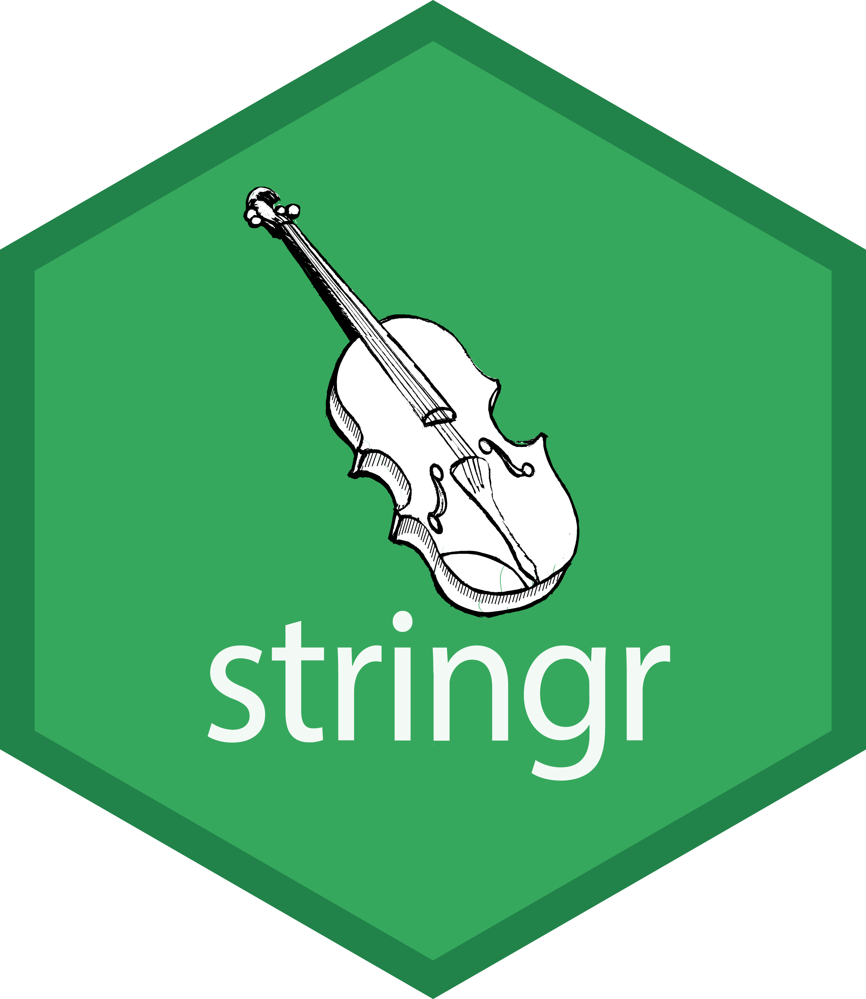
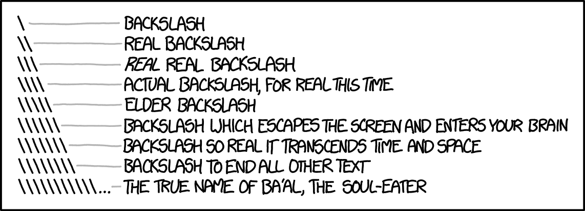

```{r setup}
#| message: false
#| warning: false
#| include: false
options(
  width = 80
)

knitr::opts_chunk$set(
  fig.align = "center", fig.retina = 2, dpi = 150,
  out.width = "100%"
)

library(stringr)
library(dplyr)
```

```{python py_setup}
#| include: false
import re

import pandas as pd
import polars as pl

pd.set_option("display.width", 80)
```


# Strings

## Strings in R and Python

In R a string is a single element of a character vector, and string functions are vectorized over those elements. 

In Python a `str` is an immutable sequence of characters that can be indexed and sliced, and its methods act on one string at a time.

:::: {.columns .xsmall}
::: {.column width='50%'}
```{r}
x = c("apple", "banana", "kiwi")
```
```{r}
nchar(x)
substr(x, 1, 3)
toupper(x)
```
:::

::: {.column width='50%' .fragment}
```{python}
x = "banana"
```
```{python}
len(x)
x[0:3]
x.upper()
[
  s.upper()
  for s in ["apple", "banana", "kiwi"]
]
```
:::
::::


# {#stringr-logo data-menu-title="stringr" .nostretch}

{fig-align="center" width="32%"}


## `stringr`

`stringr` is the tidyverse's string package, built on `stringi` and the ICU C library. Base R has equivalents for most of its functions (`paste()`, `substr()`, `nchar()`, `gsub()`, ...), but their names and argument orders are inconsistent.

* Most string-manipulation functions start with `str_`.

* Most take the string as the first argument, making them convenient to use with pipes.

* Functions are vectorized over the string inputs. Some, such as `str_detect()`, also accept a vector of patterns.

* Missing strings generally produce missing results.


## String operations

Most everyday string tasks have a direct equivalent in each language.

::: {.small}
| Task                 | R / `stringr`                          | Python                                      |
|:---------------------|:-------------------------------------|:--------------------------------------------|
| length               | `str_length()`                       | `len()`                                     |
| substring            | `str_sub()`                          | `s[i:j]`                                    |
| combine              | `str_c()`, `str_flatten()`           | `+`, `sep.join()`                           |
| literal split        | `str_split(s, fixed(sep))`           | `s.split(sep)`                              |
| regex split          | `str_split(s, pattern)`              | `re.split(pattern, s)`                      |
| trim whitespace      | `str_trim()`, `str_squish()`         | `s.strip()`, `" ".join(s.split())`          |
| pad                  | `str_pad()`                          | `s.rjust()`, `s.ljust()`, `s.zfill()`       |
| case                 | `str_to_upper()`, `str_to_title()`   | `s.upper()`, `s.title()`                    |
| templates            | `str_glue()`                         | f-strings                                   |
| number formatting    | `formatC()`, `format()`              | [format spec](https://docs.python.org/3/library/string.html#formatspec), `f"{x:.3f}"` |
| many strings         | vectorized                           | comprehension, `.str` accessor              |
:::


## Strings in data frames

`stringr` functions are vectorized, so they work directly inside `mutate()`.

Python's string methods are not, so pandas and polars expose vectorized versions through the `.str` accessor.

:::: {.columns .mxsmall}
::: {.column width='50%'}
```{r}
d = tibble(
  name = c("Bob Smith", "Alice Jones")
)
```
:::

::: {.column width='50%' .fragment}
```{python}
import polars as pl
d = pl.DataFrame({
  "name": ["Bob Smith", "Alice Jones"]
})
```
:::
::::

:::: {.columns .xsmall}
::: {.column width='50%'}
```{r}
d |>
  mutate(
    upper = str_to_upper(name),
    n = str_length(name)
  )
```
:::

::: {.column width='50%' .fragment}
```{python}
d.with_columns(
  upper = pl.col("name").str.to_uppercase(),
  n = pl.col("name").str.len_chars()
)
```
:::
::::

::: {.aside}
The two `.str` accessors are not the same. `pandas` mostly keeps Python's method names (`.str.upper()`, `.str.len()`) while `polars` uses its own (`.str.to_uppercase()`, `.str.len_chars()`).
:::


# Regular expressions

## Regular expressions

A regular expression (regex) is a sequence of characters that describes a pattern to be matched in text. Regexes are used to detect, extract, replace, and split strings, and to validate input.

* The idea dates to the 1950s, when Stephen Kleene formalized regular languages.

* They came into common use in the late 1960s and early 1970s through Unix text processing tools like `ed`, `grep`, and `sed`.

* Most modern languages use a syntax descended from Perl's. The core is shared, but each engine differs in its details.

* In R, `stringr` uses the ICU engine and base R uses [TRE](https://en.wikipedia.org/wiki/TRE_%28computing%29) by default or [PCRE](https://en.wikipedia.org/wiki/Perl_Compatible_Regular_Expressions) when `perl = TRUE`.

* We will work through the syntax using `stringr`, and then see how it translates to Python's `re` module.


## `stringr` regular expression functions

::: {.medium}

| Function     | Description                         |
|:-------------|:------------------------------------|
|`str_detect`  | Detect the presence or absence of a pattern in a string. |
|`str_subset`  | Subset a vector of strings based on the presence of a pattern. |
|`str_count`   | Count the number of matches in a string. |
|`str_locate`  | Locate the first position of a pattern and return a matrix with start and end. |
|`str_extract` | Extract the text corresponding to the first match. |
|`str_match`   | Extract capture groups formed by `()` from the first match. |
|`str_split`   | Split a string into pieces and return a list of character vectors. |
|`str_replace` | Replace the first matched pattern and return a character vector. |
|`str_remove`  | Remove the first matched pattern and return a character vector. |
|`str_view`    | Show the matches made by a pattern. |

:::

<p></p>

Many of these functions have variants with an `_all` suffix (e.g. `str_replace_all`) which will match more than one occurrence of the pattern in a string.


## Simple pattern detection

::: {.xsmall}
```{r}
text = c("The quick brown", "fox jumps over", "the lazy dog")
```
```{r}
str_detect(text, "quick")
str_subset(text, "o")
```
:::

. . .

::: {.xsmall}
```{r}
str_detect(text, "the")
str_detect(text, regex("the", ignore_case = TRUE))
```
:::


## Escape characters

An escape character changes the interpretation of the character(s) that follow it. In R string literals the escape character is `\`.

::: {.medium}

| Literal | Character        |
|:--------|:-----------------|
|`\'`     | single quote     |
|`\"`     | double quote     |
|`\\`     | backslash        |
|`\n`     | new line         |
|`\r`     | carriage return  |
|`\t`     | tab              |
|`\b`     | backspace        |
|`\f`     | form feed        |

:::


## Escapes in practice

`print()` shows a string as it would be typed, escapes included. `cat()` shows the actual characters.

:::: {.columns .xsmall}
::: {.column width='50%'}
```{r}
print("a\tb")
cat("a\tb")
nchar("a\tb")
```
:::

::: {.column width='50%' .fragment}
```{r}
print("a\\b")
cat("a\\b")
nchar("a\\b")
```
:::
::::

:::: {.columns .xsmall}
::: {.column width='50%' .fragment}
```{r}
print("a\nb")
cat("a\nb")
nchar("a\nb")
```
:::

::: {.column width='50%' .fragment}
```{r}
print("a\"b")
cat("a\"b")
nchar("a\"b")
```
:::
::::


## Raw strings

A raw string turns off escape processing, so a backslash is just a backslash. As of R 4.0 these are written as `r"(...)"`.

::: {.xsmall}
```{r}
cat("\\int_0^\\infty 1/e^x")
cat(r"(\int_0^\infty 1/e^x)")
```
:::

. . .

::: {.xsmall}
```{r}
r"(\d+\.\d+)"
"\\d+\\.\\d+" == r"(\d+\.\d+)"
```
:::

::: {.aside}
`[]` and `{}` can be used in place of `()`. See `?Quotes` for details.
:::


## Regex metacharacters

The power of regular expressions comes from metacharacters, which modify how the pattern is matched.

```regex
. ^ $ * + ? { } [ ] \ | ( )
```

. . .

To match one of these literally it needs to be escaped with a `\`. Regex escapes sit on top of string escapes, so without raw strings we need two levels of escaping.

<p></p>

| To match | Regex | R literal | R raw       |
|----------|-------|-----------|-------------|
| `.`      | `\.`  | `"\\."`   | `r"(\.)"`   |
| `?`      | `\?`  | `"\\?"`   | `r"(\?)"`   |
| `+`      | `\+`  | `"\\+"`   | `r"(\+)"`   |
| `\`      | `\\`  | `"\\\\"`  | `r"(\\)"`   |


## Matching metacharacters

::: {.small}
```r
str_detect("abc[def", "\[")
```
```
## Error: '\[' is an unrecognized escape
```
:::

. . .

::: {.xsmall}
```{r}
str_detect("abc[def", "\\[")
```
:::

. . .

::: {.xsmall}
```{r}
cat("abc\\def")
str_detect("abc\\def", "\\\\")
str_detect("abc\\def", r"(\\)")
```
:::

. . .

::: {.medium}
When the pattern is plain text, `fixed()` treats it literally, so regex escaping is unnecessary. Normal R string-literal escaping still applies unless we use a raw string.
:::

::: {.xsmall}
```{r}
str_detect("abc[def", fixed("["))
```
:::


## XKCD's take

<p></p>
<p></p>

```{r echo=FALSE, fig.align="center", out.width="80%"}

```


## Anchors

Sometimes we want a pattern to match only at a particular location in a string. Anchors match a position rather than a character.

::: {.columns .small}
::: {.column}
| Regex | Meaning in `stringr` |
|-------|:---------------------------------------------|
| `^`   | Start of string (or line, in multiline mode) |
| `$`   | End of string (or line, in multiline mode) |
| `\b`  | Word boundary |
| `\B`  | Not word boundary |
:::

::: {.column}
| Regex | Meaning in `stringr` |
|-------|:---------------------------------------------|
| `\A`  | Start of string, always |
| `\Z`  | End of string or before a trailing newline |
| `\z`  | End of string, always |
:::
:::

. . .

::: {.mt-3}

::: {.mxsmall}
```{r}
text = "the brown owl ate the egg"
```
:::

:::: {.columns .mxsmall}
::: {.column width='50%'}
```{r}
str_replace(text, "^the", "---")
str_replace(text, "the$", "---")
str_replace(text, "egg$", "---")
```
:::

::: {.column width='50%' .fragment}
```{r}
str_replace_all(text, "e", "*")
str_replace_all(text, "e\\b", "*")
str_replace_all(text, "e\\B", "*")
```
:::
::::
:::

::: {.aside}
Python's `\Z` behaves like `stringr`'s `\z`.
:::


## Alternation

If there is more than one pattern we would like to match we can use the or (`|`) metacharacter. It has the lowest precedence of any operator, so use parentheses to limit its scope.

::: {.xsmall}
```{r}
str_replace_all(text, "the|egg", "---")
str_replace_all(text, "a|e|i|o|u", "*")
```
:::

. . .

::: {.xsmall}
```{r}
str_replace_all(text, "\\ba|e|i|o|u", "*")
str_replace_all(text, "\\b(a|e|i|o|u)", "*")
```
:::

::: {.aside}
Parentheses group alternatives, so `\b(a|e|i|o|u)` applies the word boundary to every vowel. These parentheses also capture the matched text, which we'll use later.
:::


## Classes and ranges

A character class matches any one character from a set, which is written inside square brackets. Ranges simplify classes made up of contiguous letters or digits.

<p></p>

::: {.small}
| Class    | Type        |
|----------|:------------|
| `[abc]`  | Class (a or b or c) |
| `[^abc]` | Negated class (not a or b or c) |
| `[a-c]`  | Range (lower case letter from a to c) |
| `[A-C]`  | Range (upper case letter from A to C) |
| `[0-7]`  | Range (digit from 0 to 7) |
:::

. . .

::: {.xsmall .mt-3}
```{r}
text = c("apple", "(219) 733-8965")
```
:::

:::: {.columns .xsmall}
::: {.column width='50%'}
```{r}
str_replace_all(text, "[aeiou]", "*")
str_replace_all(text, "[13579]", "*")
```
:::

::: {.column width='50%' .fragment}
```{r}
str_replace_all(text, "[1-5a-f]", "*")
str_replace_all(
  text, "[^1-5a-f]", "*"
)
```
:::
::::


## Character classes

Some classes are common enough that they have built-in shorthands.

<p></p>

::: {.small}
| Meta char | POSIX class | Description |
|:----------:|:--------------|:-----------------------------------------------------------|
| `.`  |               | Any character except a line terminator, unless `dotall = TRUE` |
| `\s` | `[[:space:]]` | White space |
| `\S` |               | Not white space |
| `\d` | `[[:digit:]]` | Unicode decimal digit; use `[0-9]` for ASCII digits |
| `\D` |               | Not digit |
| `\w` |               | Unicode word character, including letters, digits, combining marks, and `_` |
| `\W` |               | Not word |
|      | `[[:alpha:]]` | Letter |
|      | `[[:punct:]]` | Punctuation |
:::

::: {.aside}
POSIX classes like `[:alpha:]` belong inside a bracket expression, e.g. `[[:alpha:]_]` or `[^[:space:]]`. `stringr` also accepts them on their own, but base R does not. Python's `re` does not support them at all.
:::


## Unicode character classes

`stringr`'s character classes follow Unicode categories, so they include characters beyond ASCII. Here `٣` is the Arabic-Indic digit three, `_` is both a word character and punctuation, and `+` is a symbol rather than punctuation.

::: {.xsmall}
```{r}
tibble(
  char = c("A", "é", "٣", "_", "+"),
  digit = str_detect(char, r"(\d)"),
  word = str_detect(char, r"(\w)"),
  punctuation = str_detect(char, "[[:punct:]]")
)
```
:::


## Example

How would we write a regular expression to match a telephone number with the form `(###) ###-####`?

::: {.xsmall}
```{r}
text = c("apple", "(219) 733-8965", "(329) 293-8753")
```
:::

. . .

::: {.xsmall}
```{r}
str_detect(text, "(\\d\\d\\d) \\d\\d\\d-\\d\\d\\d\\d")
```
:::

. . .

::: {.xsmall}
```{r}
str_detect(text, "\\(\\d\\d\\d\\) \\d\\d\\d-\\d\\d\\d\\d")
```
:::


## Quantifiers

Attached to literals, character classes, or groups, these allow a match to repeat some number of times.

<p></p>

| Quantifier | Description |
|:-----------|:------------|
| `*`        | Match 0 or more |
| `+`        | Match 1 or more |
| `?`        | Match 0 or 1 |
| `{3}`      | Match exactly 3 |
| `{3,}`     | Match 3 or more |
| `{3,5}`    | Match 3, 4 or 5 |


## Example

How would we improve our previous regular expression for matching a telephone number with the form `(###) ###-####`?

::: {.xsmall}
```{r}
text = c("apple", "(219) 733-8965", "(329) 293-8753")
```
```{r}
str_detect(text, "\\(\\d\\d\\d\\) \\d\\d\\d-\\d\\d\\d\\d")
```
:::

. . .

::: {.xsmall}
```{r}
str_detect(text, "\\(\\d{3}\\) \\d{3}-\\d{4}")
str_extract(text, "\\(\\d{3}\\) \\d{3}-\\d{4}")
```
:::


## Exercise 1

::: {.medium}
For this exercise, treat the first token as the first name and everything after the first space as the last name, including prefixes and compound names. Match vowels (`a`, `e`, `i`, `o`, `u`) without regard to case.
:::

For the following vector of randomly generated names, write a regular expression that,

* detects if the person's first name starts with a vowel (a,e,i,o,u)

* detects if the person's last name starts with a vowel

* detects if either the person's first or last name starts with a vowel

* detects if neither the person's first nor last name starts with a vowel

::: {.xsmall}
```{r}
x = c("Jeremy Cruz", "Nathaniel Le", "Jasmine Chu", "Bradley Calderon Raygoza",
      "Quinten Weller", "Katelien Kanamu-Hauanio", "Zuhriyaa al-Amen",
      "Travale York", "Alexis Ahmed", "David Alcocer", "Jairo Martinez",
      "Dwone Gallegos", "Amanda Sherwood", "Hadiyya el-Eid", "Shaimaaa al-Can",
      "Sarah Love", "Shelby Villano", "Sundus al-Hashmi", "Dyani Loving",
      "Shanelle Douglas")
```
:::


## Extracting matches

`str_extract()` returns the first match in each string, or `NA` when there is none. `str_extract_all()` returns every match, as a list with one element for each string.

::: {.xsmall}
```{r}
x = c(
  "Midterms on 2026-10-14 and 2026-11-18",
  "Final on 2026-12-12",
  "No project"
)
date = "\\d{4}-\\d{2}-\\d{2}"
```
:::

. . .

::: {.xsmall}
```{r}
str_extract(x, date)
```
:::

. . .

::: {.xsmall}
```{r}
str_extract_all(x, date)
```
:::


## Greedy vs non-greedy matching

At a given starting position, a greedy quantifier tries to consume as much text as possible while allowing the rest of the pattern to match. Adding `?` makes it non-greedy, so it consumes as little as possible while still allowing the rest to match.

::: {.xsmall}
```{r}
text = "<div class='main'> <div> <a href='here.pdf'>Here!</a> </div> </div>"
```
:::

. . .

::: {.xsmall}
```{r}
str_extract(text, "<div>.*</div>")
```
:::

. . .

::: {.xsmall}
```{r}
str_extract(text, "<div>.*?</div>")
```
:::

::: {.aside}
This example illustrates matching behavior. Use an HTML parser for general HTML processing.
:::


## Groups

Groups allow you to connect pieces of a regular expression for modification or capture.

<p></p>

| Group           | Description                              |
|-----------------|:-----------------------------------------|
| <code>(a&vert;b)</code> | match literal "a" or "b", group either   |
| `a(bc)?`        | match "a" or "abc", group bc or nothing  |
| `(abc)def(ghi)` | match "abcdefghi", group abc and ghi     |
| `(?:abc)`       | match "abc", non-capturing group         |


## Groups in `stringr`

`str_extract()` returns the full match by default. Its `group` argument can select a capturing group. `str_match()` returns a matrix with the full match in the first column, followed by one column per capturing group.

::: {.xsmall}
```{r}
text = c("Bob Smith", "Alice Smith", "Apple")
```
:::

:::: {.columns .xsmall}
::: {.column width='50%'}
```{r}
str_extract(text, "^(\\w+) \\w+")
str_extract(text, "^(\\w+) \\w+", group = 1)
str_match(text, "^(\\w+) \\w+")
```
:::

::: {.column width='50%' .fragment}
```{r}
str_extract(text, "^(\\w+) (\\w+)")
str_match(text, "^(\\w+) (\\w+)")
```
:::
::::


## Multiple matches and groups

`str_match_all()` returns a list with one matrix per input string. Each row is a match. The first column contains the full match, followed by one column per capturing group.

::: {.xsmall}
```{r}
str_match_all("A12 B34", "([A-Z])([0-9]+)")
```
:::

Both matches are retained, with the letter and digits captured separately. An input with no matches gets a matrix with zero rows.


## Backreferences

Backreferences refer to previously captured groups using `\1`, `\2`, etc. They can be used in a replacement string, or within the pattern itself to match repeated text.

::: {.xsmall}
```{r}
text = c("Bob Smith", "Alice Smith", "Apple")
```
```{r}
str_replace(text, "^(\\w+) (\\w+)", "\\2, \\1")
```
:::

. . .

::: {.xsmall}
```{r}
str_detect(c("abab", "cdcd", "abcd"), "^(..)\\1$")
str_extract(c("hello", "banana", "apple"), "(.)\\1")
```
:::


## Flags

Flags change how a pattern is interpreted. In `stringr` they are set by wrapping the pattern in `regex()`.

::: {.small}
| Argument              | Behavior                                     |
|:----------------------|:---------------------------------------------|
| `ignore_case = TRUE`  | match without regard to case                 |
| `multiline = TRUE`    | `^` and `$` match at the start and end of each line |
| `dotall = TRUE`       | `.` also matches `\n`                        |
| `comments = TRUE`     | ignore whitespace and `#` comments in the pattern |
:::


::: {.xsmall .mt-3}
```{r}
str_count("the cat\nthe hat", "^the")
str_count("the cat\nthe hat", regex("^the", multiline = TRUE))
```
:::


## Regex in data frames

`stringr`'s functions are vectorized, so they can be used directly on the columns of a data frame.

::: {.xsmall}
```{r}
d = tibble(x = c("Bob Smith", "Alice Jones"))
```
:::

:::: {.columns .xsmall}
::: {.column width='50%'}
```{r}
d |>
  mutate(
    first = str_extract(x, "^\\w+"),
    s = str_detect(x, "S")
  )
```
:::

::: {.column width='50%' .fragment}
```{r}
d |>
  filter(str_detect(x, "^A"))
```
:::
::::


## Exercise 2

::: {.xsmall}
```{r}
text = c(
  "apple",
  "219 733 8965",
  "329-293-8753",
  "Work: (579) 499-7527; Home: (543) 355 3679"
)
```
:::

* Write a regular expression that will extract all of the phone numbers contained in the vector above. Expect 0, 1, 1, and 2 matches across the four inputs.

* Once that works, use capturing groups with `str_match_all()` to retain every phone number while separating the area code from the remaining number. Keep the matches associated with their original input string.


# Regular expressions in Python

## Python's `re` module

::: {.small}

| Function             | Description                         |
|:---------------------|:------------------------------------|
|`re.search(p, s)`     | Find the first match anywhere in the string, returns a `Match` or `None`. |
|`re.match(p, s)`      | Match only at the start of the string. |
|`re.fullmatch(p, s)`  | Match only if the entire string matches. |
|`re.findall(p, s)`    | Return all matches or captured groups as a list of strings or tuples. |
|`re.finditer(p, s)`   | Return all matches as an iterator of `Match` objects. |
|`re.sub(p, repl, s)`  | Replace all matches with `repl`. |
|`re.split(p, s)`      | Split the string at each match. |
|`re.compile(p)`       | Compile a pattern into an object that can be reused. |

:::


::: {.mt-3}
Most patterns shown so far translate directly, but regex engines differ in some details as well as their interfaces. 

For example `re` does not support the POSIX classes like `[[:digit:]]`. Use `\d`, `\s`, `\w`, or an explicit class such as `[a-z]`.
:::


## Raw strings in Python

Python's raw strings are written `r"..."`, and the convention is to write every regex pattern as one. 

::: {.xsmall}
```{python}
print("\\int_0^\\infty 1/e^x")
print(r"\int_0^\infty 1/e^x")
```
:::

. . .

::: {.xsmall}
```{python}
import re
text = "the brown owl ate the egg"
```
```{python}
re.sub(r"\bow", "---", text)
re.sub("\bow", "---", text)
```
:::


## Detecting patterns

`re.search()` takes a single string, so the vectorized `str_detect()` and `str_subset()` become comprehensions.

::: {.xsmall}
```{python}
text = ["The quick brown", "fox jumps over", "the lazy dog"]
```
```{python}
[re.search("quick", s) for s in text]
[bool(re.search("quick", s)) for s in text]
[s for s in text if re.search("o", s)]
```
:::

. . .

::: {.xsmall}
```{python}
[bool(re.search("the", s)) for s in text]
[bool(re.search("the", s, re.IGNORECASE)) for s in text]
```
:::


## Match objects

`re.search()` returns a `Match` object, or `None` when there is no match. `None` is falsy, so `if m:` is the usual test. Positions are 0-based and the end is exclusive.

::: {.xsmall}
```{python}
x = "fox jumps over"
```
:::

:::: {.columns .xsmall}
::: {.column width='50%'}
```{python}
m = re.search("o", x); m
m.group()
m.start(), m.end()
```
:::

::: {.column width='50%' .fragment}
```{python}
print(re.search("z", x))
re.findall("o", x)
[
  m.start()
  for m in re.finditer("o", x)
]
```
:::
::::


## Replacing and splitting

`re.sub()` plays the role of both `str_replace()` and `str_replace_all()`. Backreferences in the replacement work the same way as in `stringr`.

::: {.xsmall}
```{python}
text = "the brown owl ate the egg"
```
```{python}
re.sub(r"the", "---", text)
re.sub(r"the", "---", text, count=1)
re.sub(r"\b(a|e|i|o|u)", "*", text)
```
:::

. . .

::: {.xsmall}
```{python}
re.sub(r"^(\w+) (\w+)", r"\2, \1", "Bob Smith")
re.split(r"\s+", text)
```
:::


## Match groups in Python

A `Match` object gives access to the capture groups, with `group(0)` being the full match.

::: {.xsmall}
```{python}
m = re.search(
  r"^(\w+) (\w+)", "Bob Smith"
)
```
```{python}
m.group(0)
m.group(1)
m.group(2)
m.groups()
```
:::


## Flags and compiled patterns

Flags are passed as an additional argument and combined with `|`. `re.compile()` stores a pattern and its flags in an object with the same methods as the `re` module.

::: {.small}
| Behavior                    | `stringr::regex()`     | Python `re`                  |
|:----------------------------|:----------------------|:-----------------------------|
| ignore case                 | `ignore_case = TRUE`  | `re.IGNORECASE`, `re.I`      |
| `^` and `$` match each line | `multiline = TRUE`    | `re.MULTILINE`, `re.M`       |
| `.` matches `\n`            | `dotall = TRUE`       | `re.DOTALL`, `re.S`          |
| whitespace and comments     | `comments = TRUE`     | `re.VERBOSE`, `re.X`         |
:::

::: {.xsmall .mt-3}
```{python}
text = "The cat in\nthe hat"
```
:::

:::: {.columns .xsmall}
::: {.column width='50%'}
```{python}
re.findall(r"^the", text)
re.findall(r"^the", text, re.M)
re.findall(r"^the", text, re.M | re.I)
```
:::

::: {.column width='50%' .fragment}
```{python}
p = re.compile(r"^the", re.M | re.I)
p.findall(text)
p.sub("a", text)
```
:::
::::


## Regex in `pandas` and `polars`

Many `.str` methods in `pandas` and `polars` accept regular expressions. `polars` uses Rust's regex engine, which does not support backreferences in patterns.

:::: {.columns .xsmall}
::: {.column width='50%'}
```{python}
import pandas as pd

s = pd.Series(
  ["Bob Smith", "Alice Jones"]
)
```
```{python}
s.str.extract(r"^(\w+) (\w+)")
s.str.contains(r"S")
```
:::

::: {.column width='50%' .fragment}
```{python}
d = pl.DataFrame({
  "x": ["Bob Smith", "Alice Jones"]
})
```
```{python}
d.with_columns(
  first = pl.col("x").str.extract(r"^(\w+)"),
  s = pl.col("x").str.contains(r"S")
)
```
:::
::::


# Summary {visibility="uncounted"}

## Regex in R and Python {visibility="uncounted"}

::: {.small}
| Task                 | `stringr`                              | Python                                      |
|:---------------------|:-------------------------------------|:--------------------------------------------|
| pattern string       | `"\\d+"`, `r"(\d+)"`                 | `r"\d+"`                                    |
| detect               | `str_detect()`                       | `re.search()`                               |
| subset               | `str_subset()`                       | comprehension with `re.search()`            |
| first match          | `str_extract()`                      | `m = re.search(p, s)`<br>`m.group() if m else None` |
| all matches          | `str_extract_all()`                  | `re.findall()`, `re.finditer()`             |
| capture groups       | `str_match()`, `str_match_all()`     | `m.group(1)`, `m.groups()`, `re.findall()`  |
| replace first        | `str_replace()`                      | `re.sub(count=1)`                           |
| replace all          | `str_replace_all()`                  | `re.sub()`                                  |
| split                | `str_split()`                        | `re.split()`                                |
| no match: detect | `str_detect()` → `FALSE`            | `re.search()` → `None`                       |
| no match: first | `str_extract()` → `NA`      | check for `None` before `.group()`           |
| no match: all | `str_extract_all()` → `character(0)` per input | `re.findall()` → `[]` |
| literal pattern      | `fixed()`                            | `in`, `s.replace()`, `re.escape()`          |
| flags                | `regex(ignore_case = TRUE)`          | `re.IGNORECASE`                             |
| data frame columns   | vectorized                           | `.str.contains()`, `.str.extract()`         |
:::


## Takeaways {visibility="uncounted"}

::: {.medium}
* `stringr` gives R a consistent, vectorized set of string functions. Python's equivalents are methods on a single `str`, applied to many strings with a comprehension or the `.str` accessor of pandas and polars.

* Regular expression syntax is largely shared between the languages. `stringr` generally takes the string first and works over vectors. Python's `re` takes the pattern first and works on one string. Return values depend on the operation.

* Regex escapes sit on top of string escapes. Use raw strings, `r"(...)"` in R and `r"..."` in Python, to avoid doubling every backslash.

* Build patterns up incrementally and test them against examples that should and should not match. If a pattern becomes unreadable, a few simpler steps are usually the better choice.
:::
