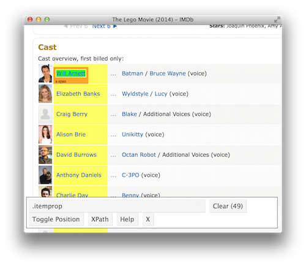
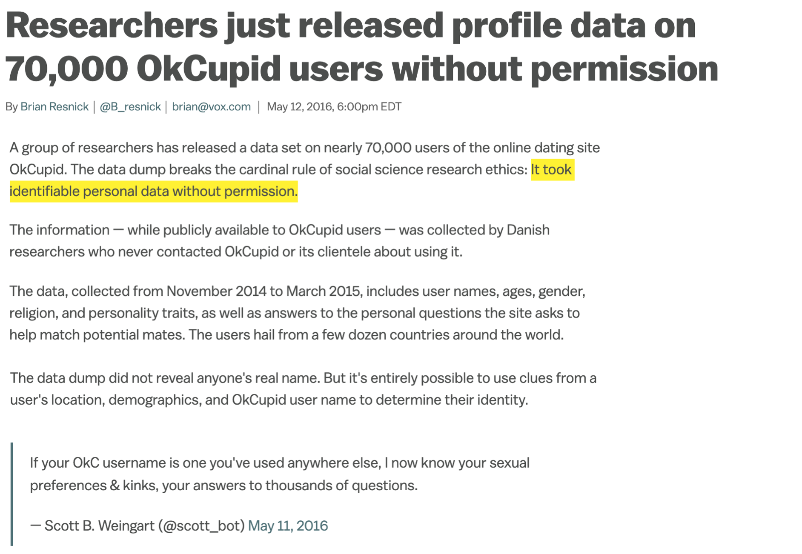
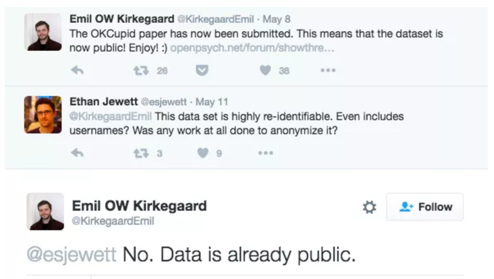
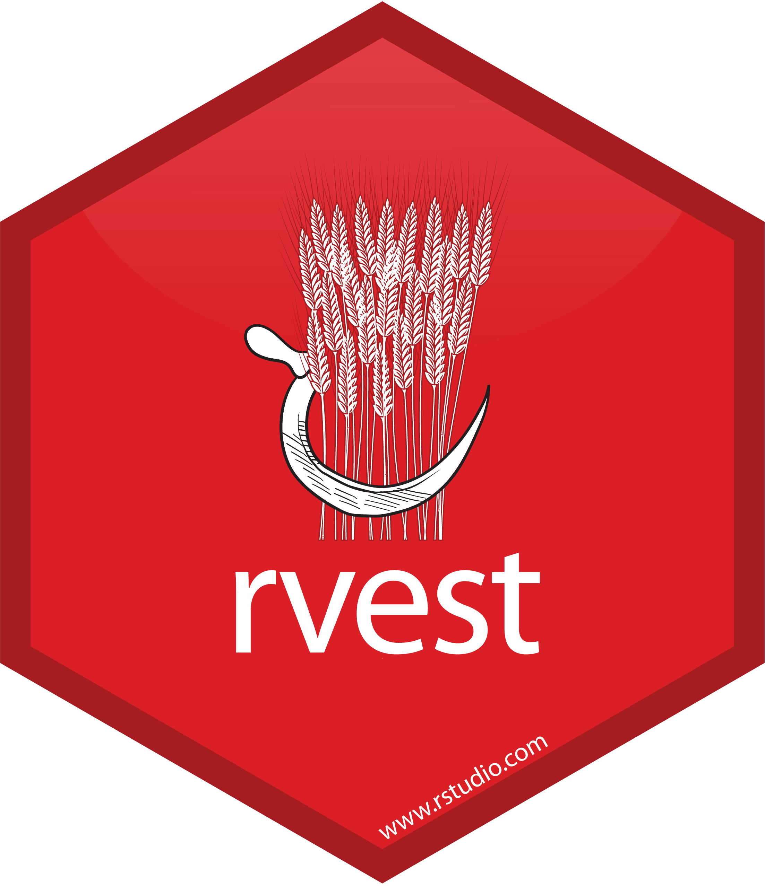

```{r setup}
#| message: false
#| warning: false
#| include: false
options(
  width = 80
)

knitr::opts_chunk$set(
  fig.align = "center", fig.retina = 2, dpi = 150,
  out.width = "100%"
)

library(rvest)
```

```{python py_setup}
#| include: false
import builtins
import pprint
import re
import sys

def _display(value):
    if value is None:
        return
    builtins._ = value
    if isinstance(value, list):
        pprint.pprint(value, width=80)
    else:
        print(repr(value))

sys.displayhook = _display
```


## Hypertext Markup Language

HTML is the language web pages are written in. It describes a page as nested elements marked by tags, which the browser renders into what we see. Web scraping is the reverse process, recovering the underlying data from that markup.

::: {.xsmall}

```html
<html>
  <head>
    <title>This is a title</title>
  </head>
  <body>
    <p align="center">Hello world!</p>
    <br/>
    <div class="name" id="first">John</div>
    <div class="name" id="last">Doe</div>
    <div class="contact">
      <div class="home">555-555-1234</div>
      <div class="home">555-555-2345</div>
      <div class="work">555-555-9999</div>
      <div class="fax">555-555-8888</div>
    </div>
  </body>
</html>
```

:::


## Anatomy of an element

An HTML document is built from elements. Most have an opening tag, optional attributes, content, and a closing tag. Void elements such as `br` and `img` have no content or closing tag.

::: {.xsmall}
```html
<div class="name" id="first">John</div>
```
:::

::: {.medium}
| Part         | Here                        | Notes                                                    |
|:-------------|:----------------------------|:---------------------------------------------------------|
| name         | `div`                       | what kind of element this is (`p`, `a`, `table`, `div`, ...) |
| attribute(s) | `class="name"` `id="first"` | name and value pairs, any number of them                 |
| content      | `John`                      | text, other elements, or both                            |
:::

. . .

Two attributes matter more than the rest when scraping:

* `class` - used to label a group of similar elements. Multiple elements can share a class, and one element can have multiple classes (`class="name bold"`).

* `id` - labels a single element and *should* be unique within a page.


## The document tree

Elements nest inside one another, so a page is a tree. Selectors describe elements by both what they are and by where they sit in the tree.

:::: {.columns}
::: {.column .xsmall width='33%'}
```
html
├── head
│   └── title
└── body
    ├── p
    ├── br
    ├── div.name#first
    ├── div.name#last
    └── div.contact
        ├── div.home
        ├── div.home
        ├── div.work
        └── div.fax
```
:::

::: {.column width='66%'}
* `html` is the root, an *ancestor* of everything else

* `body` is the *parent* of `p`, and `p` is a *child* of `body`

* `p`, `br` and the first three `div`s are *siblings*, since they share a *parent*

* `div.home` is a *descendant* of `body` but not a *child* of it
:::
::::


## Beautiful Soup

::: {.medium}
Beautiful Soup is the most widely used Python package for parsing and navigating HTML. It is installed as `beautifulsoup4` and imported as `bs4`.

* `BeautifulSoup(html, parser)` - parse HTML from a string, returning the document as a `BeautifulSoup` object.

The document and every element in it are `Tag` objects, with methods and attributes for

* selecting - `.select()`, `.select_one()` by CSS selector, `.find_all()`, `.find()` by tag name and attributes.

* extracting - `.get_text()`, `.name`, `.attrs`, and `tag["attr"]` or `tag.get("attr")` for one attribute.

* traversing and modifying - moving between parents, children and siblings, and adding, replacing or removing elements. We will not cover these.
:::

::: {.aside}
Beautiful Soup only parses HTML. It does not download pages or read tables. We will pair it with `requests` to download pages.
:::


## HTML & bs4

:::: {.columns .xsmall}
::: {.column width='50%'}
```{python}
html = '''<html>
  <head>
    <title>This is a title</title>
  </head>
  <body>
    <p align="center">Hello world!</p>
    <br/>
    <div class="name" id="first">John</div>
    <div class="name" id="last">Doe</div>
    <div class="contact">
      <div class="home">555-555-1234</div>
      <div class="home">555-555-2345</div>
      <div class="work">555-555-9999</div>
      <div class="fax">555-555-8888</div>
    </div>
  </body>
</html>'''
```
:::

::: {.column width='50%'}
```{python}
from bs4 import BeautifulSoup

soup = BeautifulSoup(html, "html.parser")
soup.title
```

::: {.fragment}
```{python}
type(soup)
type(soup.title)
type(soup.title.string)
```
:::
:::
::::

::: {.small .fragment}
| Class             | What it is                                              |
|:------------------|:--------------------------------------------------------|
| `BeautifulSoup`   | the whole document, behaves like a `Tag`                |
| `Tag`             | an element, with a name, attributes and children        |
| `NavigableString` | a run of text inside a tag, behaves like a `str`        |
:::


## Parsers {.scrollable}

The second argument to `BeautifulSoup()` picks the parser. Real pages are often not well formed, and each parser repairs broken HTML differently. The result is the tree you will be selecting from, so pick one parser and use it consistently. `prettify()` shows the repaired tree as indented HTML.

::: {.xsmall}
```{python}
bad = "<p>One<p>Two<li>Three"
```
:::

. . .

:::: {.columns .mxsmall}
::: {.column width='50%'}
```{python}
BeautifulSoup(bad, "html.parser")
```

::: {.fragment}
```{python}
print(
  BeautifulSoup(bad, "html.parser")
  .prettify()
)
```
:::
:::

::: {.column width='50%'}
```{python}
BeautifulSoup(bad, "lxml")
```

::: {.fragment}
```{python}
print(
  BeautifulSoup(bad, "lxml")
  .prettify()
)
```
:::
:::
::::

::: {.aside}
`"html.parser"` is built into Python. `"lxml"` is faster and `"html5lib"` is the most forgiving of broken HTML, but both need to be installed separately.
:::


## Tags as attributes

The simplest way to reach an element is by its tag name, as an attribute of the document or of another `Tag`. This returns the first element with that name, or `None` if there is none.

::: {.xsmall}
```{python}
soup.title
soup.p
```
:::

. . .

::: {.xsmall}
```{python}
soup.div
soup.body.div
```
:::

. . .

::: {.xsmall}
```{python}
print(soup.body.dv)
```
:::

::: {.aside}
`soup.body.div` is shorthand for `soup.find("body").find("div")`. It is convenient for exploring a page, but it only ever gives the first match and a typo in the tag name silently returns `None`.
:::


## Selecting elements

`select()` returns all matches as a list, and `select_one()` returns the first matching `Tag`, or `None`. Both can be called on the whole document or on any `Tag`.

::: {.xsmall}
```{python}
soup.select("p")
```
:::

. . .

::: {.xsmall}
```{python}
p = soup.select_one("p"); p
```
:::

. . .

::: {.xsmall}
```{python}
soup.select_one(".contact").select("div")
```
:::


## Many elements

The extraction methods belong to a single `Tag`. With more than one element you will need to use a comprehension.

::: {.xsmall .wrap-output}
```{python}
#| error: true
soup.select(".name").get_text()
```
:::

. . .

::: {.xsmall}
```{python}
[d.get_text() for d in soup.select(".name")]
```
:::

. . .

::: {.xsmall}
```{python}
[d["id"] for d in soup.select(".name")]
```
:::


## CSS selectors

CSS (Cascading Style Sheets) is the language used to style web pages. A stylesheet is a list of rules, and each rule starts with a selector that says which elements the styling applies to.

::: {.xsmall}
```css
div.name {
  color: blue;
  font-weight: bold;
}

#first {
  font-size: 120%;
}
```
:::

Scraping tools borrow just the selector half of the language. It is a compact, standardized way of describing a set of elements, and it is already understood by a wide variety of tools.

::: {.aside}
Beautiful Soup's `select()` is implemented by the `soupsieve` package, which supports the CSS selector standard along with a few extensions of its own.
:::


## Basic selectors

The simplest selectors match on an element's tag name, its class, or its id. These can be written together with no spaces to require that all of them match, or separated by commas to match any of them.

::: {.small}

Selector         |  Example         | Description
:----------------|:-----------------|:--------------------------------------------------
element          |  `p`             | Select all &lt;p&gt; elements
.class           |  `.name`         | Select all elements with class="name"
#id              |  `#first`        | Select all elements with id="first"
element.class    |  `div.name`      | Select all &lt;div&gt; elements with class="name"
A, B             |  `p, #last`      | Select everything matched by either selector

:::

. . .


::: {.pt-3}
::: {.columns .xsmall}

::: {.column}
```{python}
soup.select(".name")
```

::: {.fragment}
```{python}
soup.select("#first")
```
:::
:::

::: {.column .fragment}
```{python}
soup.select("p, #last")
```
:::

:::
:::


## Combinators

Combinators join two selectors and match on the relationship between elements in the tree. The element that is returned is always the last one in the selector.

::: {.small}

Selector    |  Example       | Description
:-----------|:---------------|:--------------------------------------------------
A B         |  `body div`    | Select all &lt;div&gt; elements anywhere inside &lt;body&gt; (descendant)
A > B       |  `body > div`  | Select all &lt;div&gt; elements directly inside &lt;body&gt; (child)
A + B       |  `.work + div` | Select the &lt;div&gt; immediately after a `.work` element (adjacent sibling)
A ~ B       |  `.home ~ div` | Select all &lt;div&gt; siblings that come after a `.home` element

:::

. . .


::: {.mt-3}
::: {.columns .mxsmall}

::: {.column}
```{python}
soup.select("body div")
```
:::

::: {.column .fragment}
```{python}
soup.select("body > div")
soup.select(".work + div")
```
:::

:::
:::


## Attribute selectors

Any attribute can be used in a selector. This is most useful for links and images, e.g. `a[href^="https"]` or `img[src$=".png"]`.

::: {.small}

Selector          |  Example            | Description
:-----------------|:--------------------|:--------------------------------------------------
`[attr]`          |  `[align]`          | Select all elements with an align attribute
`[attr=value]`    |  `[class=fax]`      | Select all elements where class is exactly "fax"
`[attr^=value]`   |  `[class^=ho]`      | Select all elements where class starts with "ho"
`[attr$=value]`   |  `[id$=st]`         | Select all elements where id ends with "st"
`[attr*=value]`   |  `[class*=or]`      | Select all elements where class contains "or"

:::

. . .

:::: {.columns .mxsmall}
::: {.column width="50%"}
```{python}
soup.select("[align]")
```
:::

::: {.column width="50%"}
```{python}
soup.select("[class^=ho]")
```
:::
::::

. . .

::: {.mxsmall}
```{python}
soup.select("[id$=st]")
```
:::


## Pseudo-classes

Pseudo-classes start with a `:` and select on an element's position among its siblings or on a condition that the other selectors cannot express.

::: {.small}

Selector          |  Example              | Description
:-----------------|:----------------------|:--------------------------------------------------
:first-child      |  `li:first-child`     | Select &lt;li&gt; elements that are the first child of their parent
:last-child       |  `li:last-child`      | Select &lt;li&gt; elements that are the last child of their parent
:nth-child(n)     |  `tr:nth-child(2)`    | Select &lt;tr&gt; elements that are the second child of their parent
:nth-child(odd)   |  `tr:nth-child(odd)`  | Select every other &lt;tr&gt;, also `even` and formulas like `3n+1`
:not(A)           |  `div:not(.ad)`       | Select &lt;div&gt; elements that do not match `.ad`
:has(A)           |  `div:has(img)`       | Select &lt;div&gt; elements that contain an &lt;img&gt;

:::

Not every tool supports every pseudo-class, so a selector that works in the browser may fail in a scraping library. For example, the newer `details:open` works in Beautiful Soup but is an error in `rvest`.

::: {.aside}
See MDN's [selector reference](https://developer.mozilla.org/en-US/docs/Web/CSS/Guides/Selectors) for the full list of selectors, combinators and pseudo-classes. Beautiful Soup also adds a few non-standard ones such as `:-soup-contains("text")`, which selects by text content but only works in `bs4`.
:::


## Pseudo-classes

::: {.xsmall}
```{python}
soup.select(".contact div:first-child")
```
:::

. . .

::: {.xsmall}
```{python}
soup.select(".contact div:nth-child(2)")
```
:::

. . .

::: {.xsmall}
```{python}
soup.select(".contact div:not(.home)")
```
:::

. . .

::: {.xsmall}
```{python}
soup.select("div:has(.work)")
```
:::

. . .

::: {.xsmall}
```{python}
soup.select(".contact div:-soup-contains('9999')")
```
:::

::: {.aside}
`:-soup-contains()` is a `bs4` extension, this selector will not work in the browser or in `rvest`.
:::


## Choosing a selector

There are usually many selectors that return the same elements. The goal is one that keeps working even if the page changes.

* Prefer classes and IDs that describe the content (`.price`, `#reviews`) over ones that describe position (`div > div:nth-child(3)`).

* Be as specific as needed and no more. A long chain of tags breaks the first time the site adds a `div`.

* Be wary of machine-generated class names like `.css-1q2w3e`, which tend to change with every update of the site.

* Anchor on a stable container, then select within it (`#results .title`).

* Always check how many elements came back. Too many or too few is the first sign that the selector is wrong.

* Not everything needs to be purely selector based - you can also process via Python or R after extraction.


## Missing elements

When nothing matches, `select()` returns an empty list and `select_one()` returns `None`, so chaining a method onto a missing element is an error.

::: {.xsmall}
```{python}
soup.select("span")
print(soup.select_one("span"))
```
:::

. . .

::: {.xsmall}
```{python}
#| error: true
soup.select_one("span").get_text()
```
:::

. . .

Attributes behave similarly, `tag["attr"]` raises a `KeyError` if the attribute is missing while `tag.get("attr")` returns `None`.

::: {.xsmall}
```{python}
print(p.get("class"))
```
:::


## `find()` and `find_all()`

Beautiful Soup also has its own search methods that match on tag name and attribute values. `find_all()` returns a list and `find()` returns the first match (or `None`). Both can be chained, as each `Tag` is searched in the same way as the full document.

::: {.xsmall}
```{python}
soup.find_all("div", class_="home")
```
:::

. . .

::: {.xsmall}
```{python}
soup.find(id="last")
```
:::

. . .

::: {.xsmall}
```{python}
soup.find("div", class_="contact").find_all("div", class_="work")
```
:::

. . .

::: {.xsmall}
```{python}
soup.find(id="first")["class"]
```
:::

::: {.aside}
`class_` has a trailing underscore because `class` is reserved in Python. Since an element can have several classes, `tag["class"]` is always a list.
:::


## More flexible searching

Where `find_all()` earns its place over `select()` is in what it accepts as a filter. The tag name and each attribute can be a string, a list of strings, a regular expression, or `True` to match any value, and `string=` searches the text instead of the tags.

::: {.xsmall}
```{python}
soup.find_all(["p", "title"])
```
:::

. . .

::: {.xsmall}
```{python}
soup.find_all(class_=re.compile("^ho"))
```
:::

. . .

::: {.xsmall}
```{python}
soup.find_all(string=re.compile("555"))
```
:::

. . .

A function can be used as well, it receives each `Tag` and should return `True` for a match.

::: {.xsmall}
```{python}
soup.find_all(lambda t: t.name == "div" and t.get_text().endswith("4"))
```
:::


## Extracting text

`get_text()` returns the raw text of a tag and all of its descendants, including the source whitespace. The `separator` and `strip` arguments control how the pieces are joined.

::: {.xsmall}
```{python}
contact = soup.select_one(".contact")
contact.get_text()
```
:::

. . .

::: {.xsmall}
```{python}
contact.get_text(" ", strip=True)
```
:::

. . .

The `.stripped_strings` generator gives the same pieces as a list, one per descendant, with the whitespace removed.

::: {.xsmall}
```{python}
list(contact.stripped_strings)
```
:::


## Extracting text

`.string` is the text of a tag that has exactly one string as its content. It works for simple elements such as `p` or `div.home`, but a tag that contains other elements has no single string, so `.string` is `None` and `get_text()` must be used instead.

::: {.xsmall}
```{python}
soup.p.string
soup.select_one("div.home").string
```
:::

. . .

::: {.xsmall}
```{python}
print(contact.string)
```
:::

. . .

::: {.xsmall}
```{python}
contact.get_text(" ", strip=True)
```
:::


## Reading from the web

`BeautifulSoup()` does not accept a URL, so the page is downloaded first with `requests` and the text of the response is then parsed.

::: {.xsmall}
```{python}
#| eval: false
import requests

r = requests.get("https://example.com", timeout=10)
r.raise_for_status()

soup = BeautifulSoup(r.text, "html.parser")
soup.select(".title")
```
:::

`raise_for_status()` turns a failed request (404, 500, ...) into an exception. Without it we would happily parse the error page.

::: {.aside}
We will look at `requests` and HTTP in much more detail in the coming lectures.
:::


## SelectorGadget

This is a JavaScript-based tool that helps you interactively build an appropriate CSS selector for the content you are interested in.


::: {.center}
```{r}
#| echo: false
#| out.width: "45%"

```
[selectorgadget.com](https://selectorgadget.com)
:::


# Web scraping considerations


## "Can you?" vs "Should you?"

```{r}
#| echo: false
#| out.width: "60%"

```

::: {.aside}
Source: Brian Resnick, [Researchers just released profile data on 70,000 OkCupid users without permission](https://www.vox.com/2016/5/12/11666116/70000-okcupid-users-data-release), Vox.
:::


## "Can you?" vs "Should you?"

```{r}
#| echo: false
#| out.width: "70%"

```


## Crawl rules & `robots.txt`

::: {.medium}
Sites use the [robots exclusion standard](https://www.rfc-editor.org/rfc/rfc9309.html) to publish crawler rules in `robots.txt`. Following these rules does not mean you are authorized to use the website to collect the data. Also consider the site's terms and the privacy of the people represented in the data.

You can find examples at all of your favorite websites: [Google](https://www.google.com/robots.txt), [Facebook](https://facebook.com/robots.txt), etc.
:::

. . .

::: {.medium}
These files are meant to be machine readable, and `urllib.robotparser` from the standard library reads them. Check the rules for the same user agent that you will send with your requests.
:::

::: {.xsmall}
```{python}
#| eval: false
from urllib.robotparser import RobotFileParser

user_agent = "sta523-example"
rp = RobotFileParser("https://www.google.com/robots.txt")
rp.read()

rp.can_fetch(user_agent, "https://www.google.com/search?q=duke")
rp.can_fetch(user_agent, "https://www.google.com/maps")
```
:::

::: {.aside}
These rules apply to this site. Fetch a separate `robots.txt` when changing sites. An allowed path does not establish permission to reuse its data.
:::


## Rate limiting

::: {.medium}
Making requests too quickly can overload a server, get your IP blocked, or violate a site's terms of service. Adding delays between requests is essential for responsible scraping.
:::

. . .

::: {.medium}
The simplest approach is `time.sleep()` between requests. This loop uses `rp` from the previous slide and only URLs on that site.
:::

::: {.mxsmall}
```{python}
#| eval: false
import time

user_agent = "sta523-example"
urls = ["https://www.google.com/search?q=duke",
        "https://www.google.com/maps"]

for url in urls:
  if rp.can_fetch(user_agent, url):
    try:
      r = requests.get(url, headers={"User-Agent": user_agent}, timeout=10)
      r.raise_for_status()
    finally:
      time.sleep(5)
```
:::

::: {.aside}
`finally` keeps the delay even if a request fails. `robots.txt` can also specify a `Crawl-delay`, available via `rp.crawl_delay(user_agent)`, but this is not a super common feature.
:::


## Graceful error handling

When scraping many pages, retrieval or parsing can fail. Wrapping the request in `try` / `except` lets us capture those errors and continue, returning `None` on failure.

::: {.mxsmall}
```{python}
#| eval: false
def safe_read(url):
  try:
    r = requests.get(url, timeout=10)
    r.raise_for_status()
    return BeautifulSoup(r.text, "html.parser")
  except requests.RequestException:
    return None

pages = [safe_read(url) for url in urls]
```
:::

. . .

Keeping the exception alongside the result lets us inspect what went wrong afterwards.

::: {.mxsmall}
```{python}
#| eval: false
def safe_read(url):
  try:
    r = requests.get(url, timeout=10)
    r.raise_for_status()
    return {"result": BeautifulSoup(r.text, "html.parser"), "error": None}
  except requests.RequestException as e:
    return {"result": None, "error": e}
```
:::

::: {.aside}
Missing selectors usually return empty results rather than errors, so check counts and required fields explicitly.
:::


## Example - Rotten Tomatoes

Open [Movies at Home, sorted by popularity](https://www.rottentomatoes.com/browse/movies_at_home/sort:popular). Inspect the page and choose selectors that let us retrieve the following details:

* title, 
* Tomatometer score, 
* displayed critic-status label,
* absolute movie URL

Using these selectors construct a data frame containing these results. Some movies will be missing one or more of these, use `None` for any missing fields.


# {#rvest-logo data-menu-title="rvest" .nostretch}

{fig-align="center" width="32%"}


## rvest

::: {.medium}
`rvest` is a package in the tidyverse that makes processing and manipulation of HTML data straightforward. It provides high-level functions for interacting with HTML via the `xml2` package.

* `read_html()` - read HTML data from a URL or character string.

* `html_elements()` / ~~`html_nodes()`~~ - select specified elements from the HTML document using CSS selectors (or XPath).

* `html_element()` / ~~`html_node()`~~ - select the first match within each input element using CSS selectors (or XPath).

* `html_table()` - parse an HTML table into a data frame.

* `html_text()` / `html_text2()` - extract a tag's text content.

* `html_name()` - extract a tag/element's name(s).

* `html_attrs()` - extract all attributes.

* `html_attr()` - extract attribute value(s) by name.
:::

::: {.aside}
Unlike Beautiful Soup, `read_html()` downloads as well as parses, so no extra packages are needed.
:::


## HTML, rvest, & xml2

:::: {.columns .xsmall}
::: {.column width='50%'}
```{r}
html =
'<html>
  <head>
    <title>This is a title</title>
  </head>
  <body>
    <p align="center">Hello world!</p>
    <br/>
    <div class="name" id="first">John</div>
    <div class="name" id="last">Doe</div>
    <div class="contact">
      <div class="home">555-555-1234</div>
      <div class="home">555-555-2345</div>
      <div class="work">555-555-9999</div>
      <div class="fax">555-555-8888</div>
    </div>
  </body>
</html>'
```
:::

::: {.column width='50%'}
```{r}
read_html(html)
read_html(html)[1]
```
:::
::::


## Selecting elements

`html_element()` returns the first element matching a selector, and the `html_*()` helpers extract from it.

::: {.xsmall}
```{r}
read_html(html) |> html_element("p")
```
:::


. . .

::: {.xsmall}
```{r}
read_html(html) |> html_element("p") |> html_text()
```
:::

. . .

::: {.xsmall}
```{r}
read_html(html) |> html_element("p") |> html_name()
```
:::


. . .

::: {.xsmall}
```{r}
read_html(html) |> html_element("p") |> html_attrs()
```
:::

. . .

::: {.xsmall}
```{r}
read_html(html) |> html_element("p") |> html_attr("align")
```
:::


## Selecting multiple tags

`html_elements()` returns every match as a node set. Unlike Beautiful Soup, the extraction functions are vectorized over node sets, so there is no need for a loop.

::: {.mxsmall}
```{r}
read_html(html) |> html_elements("div")
```
:::

. . .

::: {.mxsmall}
```{r}
read_html(html) |> html_elements("div") |> html_text()
```
:::

. . .

::: {.mxsmall}
```{r}
read_html(html) |> html_elements(".name") |> html_attr("id")
```
:::


## Same selectors

The selector syntax also uses CSS,

:::: {.columns .mxsmall}
::: {.column width="50%"}
```{r}
read_html(html) |> html_elements("p, #last")
```

::: {.fragment}
```{r}
read_html(html) |> html_elements("body > div")
```
:::
:::

::: {.column width="50%"}
::: {.fragment}
```{r}
read_html(html) |> html_elements("[class^=ho]")
```
:::

::: {.fragment}
```{r}
read_html(html) |> html_elements(".contact div:not(.home)")
```
:::
:::
::::

::: {.aside}
`html_elements()` also supports [XPath](https://www.w3schools.com/xml/xpath_intro.asp) selectors as an alternative to CSS selectors, though we will prefer CSS selectors in this course.
:::


## Missing elements

`html_element()` returns a missing node when nothing matches and the extraction functions then return `NA`, while `html_elements()` returns an empty node set and the extraction functions return an empty vector.

:::: {.columns .mxsmall}
::: {.column width='50%'}
```{r}
page = read_html(html)
page |> html_element("span")
page |> html_element("span") |> html_text()
```
:::

::: {.column width='50%'}
```{r}
page |> html_elements("span")
page |> html_elements("span") |> html_text()
```
:::
::::

. . .

This is why `html_element()` is the right choice when extracting one field per item, as the output stays aligned with the inputs.

::: {.mxsmall}
```{r}
page |> html_elements("body > div") |> 
  html_element(".work") |> html_text()
```
:::


## `html_text()` vs `html_text2()`

::: {.xsmall}
```{r}
par = read_html(
  "<p>
    First sentence.
    Same line.<br>New line.
  </p>"
)
```
:::


. . .

::: {.xsmall}
```{r}
par |> html_text()
par |> html_text() |> cat(sep="\n")
```
:::

. . .

::: {.xsmall}
```{r}
par |> html_text2()
par |> html_text2() |> cat(sep="\n")
```
:::


## Scraping with polite

The `polite` package handles `robots.txt`, delays, and caching for us while maintaining the three pillars of a polite session:

* seek permission

* take it slowly

* never ask twice

. . .

`bow()` reads the site's `robots.txt` and returns a session object, `nod()` moves to a new path within the site, and `scrape()` makes the request (this is equivalent to `read_html()` and returns a parsed HTML object).

::: {.xsmall}
```{r}
#| eval: false
session = polite::bow("https://example.com")
polite::nod(session, "page/1") |> polite::scrape()
polite::nod(session, "page/2") |> polite::scrape()
```
:::

`polite` uses the larger of the requested delay (5 seconds by default) and the crawl delay in `robots.txt`.


## Graceful error handling

`purrr::possibly()` wraps a function so that errors return a default value instead of stopping, which is the `try` / `except` pattern from earlier packaged as a function.

::: {.xsmall}
```{r}
#| eval: false
safe_read = purrr::possibly(read_html, otherwise = NULL)
urls |>
  purrr::map(safe_read)
```
:::

. . .

`purrr::safely()` is similar but returns a list with `result` and `error` components, letting you inspect what went wrong.

::: {.xsmall}
```{r}
#| eval: false
safe_read = purrr::safely(read_html)
results = urls |> purrr::map(safe_read)
```
```{r}
#| eval: false
results |> purrr::map("result")  # successful results (NULL on failure)
results |> purrr::map("error")   # error objects (NULL on success)
```
:::


# Summary {visibility="uncounted"}

## Beautiful Soup and rvest {visibility="uncounted"}

::: {.small}
| Task                   | Python                                          | rvest                                |
|:-----------------------|:------------------------------------------------|:-------------------------------------|
| download a page        | `requests.get(url).text`                        | `read_html(url)`                     |
| parse HTML             | `BeautifulSoup(html, "html.parser")`            | `read_html(html)`                    |
| select all matches     | `select(css)`, `find_all()`                     | `html_elements(css)`                 |
| first match per input  | `select_one(css)`, `find()`                     | `html_element(css)`                  |
| no match               | `[]`, `None`                                    | empty node set / missing node        |
| text                   | `get_text()`, `get_text(sep, strip=True)`       | `html_text()`, `html_text2()`        |
| tag name               | `.name`                                         | `html_name()`                        |
| all attributes         | `.attrs`                                        | `html_attrs()`                       |
| one attribute          | `tag["href"]`, `tag.get("href")`                | `html_attr("href")`                  |
| tables                 | `pandas.read_html()`                            | `html_table()`                       |
| many elements          | comprehension                                   | vectorized                           |
| robots.txt             | `urllib.robotparser`                            | `polite::bow()`                      |
| rate limiting          | `time.sleep()`                                  | `polite::scrape()`, `Sys.sleep()`    |
| error handling         | `try` / `except`                                | `possibly()`, `safely()`             |
:::


## Takeaways {visibility="uncounted"}

::: {.medium}
* HTML is hierarchical, and scraping is the work of picking the elements we want out of that hierarchy and flattening them into a data frame.

* CSS selectors do the picking in both languages. Tools like SelectorGadget and the browser's inspector help find a selector that matches what we want and nothing else.

* Beautiful Soup's methods work on one `Tag` at a time and are combined with comprehensions, while `rvest`'s functions are vectorized over a set of elements.

* `find_all()` covers the cases a selector cannot, such as matching on text or with a regular expression.

* Just because a page can be scraped does not mean it should be. Check `robots.txt` and the terms of service, slow down your requests, and expect some of them to fail.
:::
