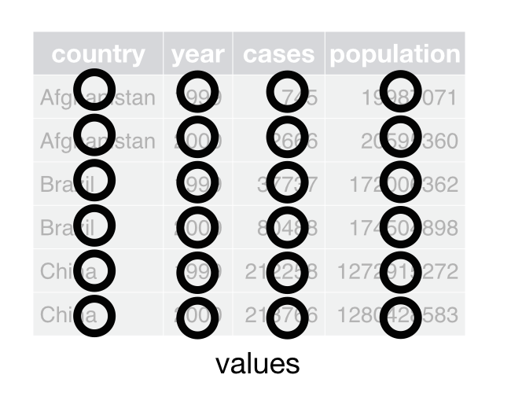
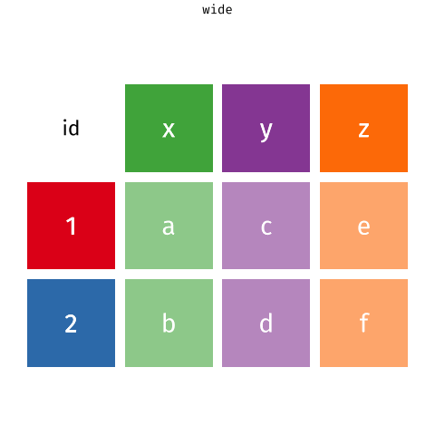
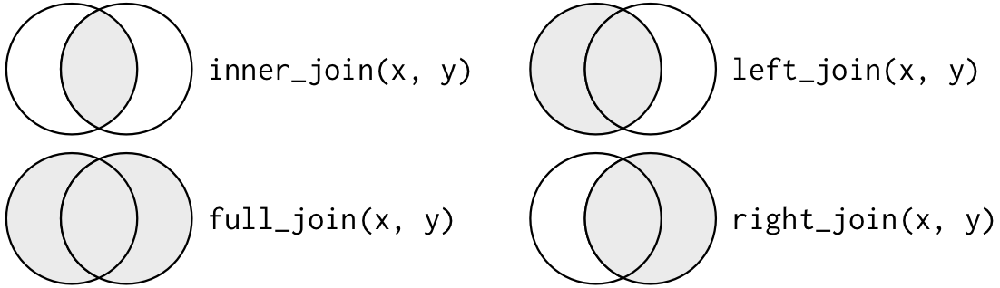

```{r setup}
#| message: false
#| warning: false
#| include: false

library(dplyr)
library(tidyr)

options(
  width = 80,
  pillar.print_max = 6,
  pillar.print_min = 6
)

if (!file.exists("data/flights.parquet")) {
  nanoparquet::write_parquet(nycflights13::flights, "data/flights.parquet")
}
if (!file.exists("data/planes.parquet")) {
  nanoparquet::write_parquet(nycflights13::planes, "data/planes.parquet")
}
```

```{python py_setup}
#| include: false
import numpy as np
import pandas as pd
import polars as pl

pd.set_option("display.width", 80)
pd.set_option("display.max_rows", 8)
pd.set_option("display.min_rows", 4)

pl.Config.set_tbl_rows(6)
pl.Config.set_tbl_cols(6)
pl.Config.set_tbl_width_chars(80)
pl.Config.set_tbl_hide_dtype_separator(True)
```

# {#polars-logo data-menu-title="polars" .nostretch}

{fig-align="center" width="80%"}


## polars

polars (2020) is a newer data frame library written in Rust on top of Apache Arrow's memory layout, with bindings for Python, R, and JavaScript. Rather than extend NumPy conventions it was designed from scratch around a few ideas,

::: {.medium}
* No index - rows are only ever positions

* A strict schema - columns have explicit types and incompatible values are rejected by default; expressions can promote types or replace columns

* Expressions - computations on columns are objects, built up and then evaluated in a context

* Lazy evaluation - queries are planned and optimized before running, on all available cores
:::

::: {.small}
```{python}
import polars as pl
pl.__version__
```
:::


## Series

A polars Series is a name, a dtype, and values - nothing else. With no index there is nothing to align on, so arithmetic is positional and lengths must match (or one side has length one). This is R's rule without recycling.

:::: {.columns .xsmall}
::: {.column width='50%'}
```{python}
pl.Series("x", [4, 2, 1, 3])
```
:::

::: {.column width='50%' .fragment}
```{python}
a = pl.Series([1, 2, 3])
b = pl.Series([10, 20, 30])
a + b
```
:::
::::

::: {.aside}
Construction is strict as well - `pl.Series([1, "a", True])` is a `TypeError` rather than an `object` column.
:::


## DataFrame

The print shows the shape and every column's dtype, much like a tibble. Note that the integer columns stayed integers despite the missing values, and that `"NA"` had to be declared as a missing value marker - polars does not guess.

::: {.xsmall}
```{python}
penguins = pl.read_csv("data/penguins.csv", null_values="NA"); penguins
```
:::


## Subsetting

Without an index there is no `.loc` / `.iloc` distinction - `df[...]` takes column names or row positions and a slice is just a slice. This is fine for a quick look, but the idiomatic way to subset is with expressions in `filter()` and `select()`.

:::: {.columns .xsmall}
::: {.column width='50%'}
```{python}
penguins["species"]
```
:::

::: {.column width='50%' .fragment}
```{python}
penguins[0:3, ["species", "island"]]
penguins[0, "species"]
```
:::
::::


## Missing values

Missing data is `null` in every dtype (like R's `NA`) and `NaN` is a floating point value, distinct from missing. `mean()` and `sum()` skip `null` by default and propagate `NaN`. Ordinary `min()` and `max()` ignore `NaN`; `nan_min()` and `nan_max()` propagate it.

::: {.xsmall}
```{python}
s = pl.Series([1.0, None, np.nan])
```
:::

:::: {.columns .xsmall}
::: {.column width='50%'}
```{python}
s
s+1
```
:::

::: {.column width='50%' .fragment}
```{python}
s.is_null().to_list()
s.is_nan().to_list()
s.mean()
s.fill_nan(None).mean()
```
:::
::::

## Expressions

`pl.col("x")` does not return a column, it returns an *expression* - a description of a computation that is not attached to any DataFrame and has not been evaluated. Expressions compose with operators and methods and are only evaluated when handed to a context. This is polars' answer to data masking - build an object that represents the code rather than capturing it.

::: {.xsmall}
```{python}
mass_kg = pl.col("body_mass_g") / 1000
mass_kg
type(mass_kg)
```
:::

. . .

::: {.xsmall}
```{python}
pl.col("body_mass_g").mean().alias("avg_mass")
```
:::

::: {.aside}
The R analog is a formula or a quosure - code stored now to be evaluated against data later.
:::


## Contexts

A context is a DataFrame method that evaluates expressions against its columns, each corresponding to a dplyr verb,

::: {.small}
| Context             | Result                                          | dplyr                        |
|:--------------------|:------------------------------------------------|:-----------------------------|
| `select()`          | a new frame containing only these expressions   | `select()`, `summarize()`    |
| `with_columns()`    | the frame with these expressions added          | `mutate()`                   |
| `filter()`          | the rows where these expressions are true       | `filter()`                   |
| `group_by().agg()`  | one row per group of these expressions          | `group_by() |> summarize()`  |
:::

. . .

<br/>

:::: {.columns .xsmall}
::: {.column width='50%'}
```{python}
penguins.select(
  "species", mass_kg.alias("mass_kg")
).head(2)
```
:::

::: {.column width='50%'}
```{python}
penguins.filter(
  pl.col("body_mass_g") > 6000
).select("species", "body_mass_g")
```
:::
::::


## Combining predicates

Multiple predicates in `filter()` are combined with AND. Use `.is_in()` for membership and `|` for OR; parenthesize comparisons when combining them with operators.

::: {.xsmall}
```{python}
penguins.filter(
  pl.col("species").is_in(["Adelie", "Gentoo"]),
  pl.col("body_mass_g") > 5000
).select("species", "body_mass_g").head(3)
```
:::

::: {.fragment .xsmall}
```{python}
penguins.filter(
  (pl.col("species") == "Gentoo")
  | (pl.col("body_mass_g") > 5000)
).select("species", "body_mass_g").head(3)
```
:::


## Expression expansion

One expression can expand to many columns - by listing names, by dtype, or with selectors from `polars.selectors`. This is `across()` with tidy selection, available in every context.

::: {.xsmall}
```{python}
import polars.selectors as cs
```
:::

. . .

::: {.xsmall}
```{python}
penguins.select(cs.ends_with("_mm").mean().name.suffix("_mean"))
```
:::

. . .

::: {.xsmall}
```{python}
penguins.select(pl.col(pl.String).n_unique())
```
:::


## group_by

`group_by()` followed by `agg()` evaluates each expression once per group and the keys come back as ordinary columns (like `.by`), in no guaranteed order. Since expressions are values the same one can be reused across contexts, and `.over()` turns an aggregation into a window computation for a grouped mutate.

:::: {.columns .xsmall}
::: {.column width='50%'}
```{python}
mass = pl.col("body_mass_g")
penguins.group_by("species").agg(
  n = pl.len(), avg = mass.mean()
).sort("species")
```
:::

::: {.column width='50%' .fragment}
```{python}
avg = mass.mean().over("species")
(penguins
  .with_columns(rel = mass / avg)
  .select("species", "rel")
  .head(2)
)
```
:::
::::


## Lazy evaluation

A `LazyFrame` shares the expression-based query API of a `DataFrame` but records transformations instead of running them. The `scan_*()` readers start lazy and `.lazy()` converts an existing frame. Planning may read metadata; `.collect()` executes the query and materializes its result.

::: {.xsmall}
```{python}
q = (
  pl.scan_parquet("data/flights.parquet")
  .filter(pl.col("dest") == "LAX")
  .group_by("carrier")
  .agg(pl.len(), pl.col("dep_delay").mean())
  .sort("len", descending=True)
)
type(q)
```
:::

. . .

::: {.medium}
Recording the whole query before running it is what makes optimization possible - the same idea underlies SQL databases and dbplyr, which we will see later in the course.
:::


## Query plan

Before running, the plan is optimized - here only 3 of the 19 columns are read from the parquet file and the filter is applied during the scan (projection and predicate *pushdown*).

::: {.xsmall}
```{python}
print( q.explain() )
```
:::


## Collecting

`collect()` runs the optimized plan and returns an ordinary DataFrame. Since the plan is known up front it can also be executed in a streaming fashion, in batches, for data larger than memory (`collect(engine="streaming")`).

::: {.xsmall}
```{python}
q.collect()
```
:::


## Interop

Arrow supports exchange between R, pandas, and polars; reticulate also converts between R and Python objects. Conversion can change dtypes and missing-value representation. For files, parquet is a shared format (Lecture 07).

Default `to_pandas()` converts nullable integer columns here to floats. Arrow extension arrays preserve their integer types and nulls.

:::: {.columns .xsmall}
::: {.column width='50%'}
```{python}
penguins.to_pandas().dtypes
```
:::

::: {.column width='50%' .fragment}
```{python}
penguins.to_pandas(
  use_pyarrow_extension_array=True
).dtypes
```
:::
::::


## Exercise 1

Using polars and `data/flights.parquet`, repeat the questions from last lecture's pandas exercise. Questions 1 and 2 are the core; 3 and 4 are extensions if time allows.

::: {.small}
1. How many flights to LAX did each legacy carrier (AA, UA, DL, US) have in May from JFK, and what was their mean actual air time (`air_time`)? Report only carriers with matching records.

2. Which plane (`tailnum`) has the most flight records from each New York airport? Exclude missing tail numbers and return all ties.

3. Which five calendar dates (`year`, `month`, `day`) had the lowest mean departure delay? Skip missing delays and break ties by earliest date.

4. Which flight has the largest arrival delay as a percentage of its actual air time (`100 * arr_delay / air_time`)? Exclude missing values and nonpositive air times, and return all ties.
:::


# Tidy data

## Tidy data

:::: {.columns}
::: {.column width='50%'}
{fig-align="center" width="70%"}
:::

::: {.column width='50%'}
{fig-align="center" width="70%"}
:::
::::

{fig-align="center" width="30%"}

::: {.aside}
From R4DS - [tidy data](https://r4ds.hadley.nz/data-tidy.html)
:::


## Tidy vs untidy

> Happy families are all alike; every unhappy family is unhappy in its own way
>
> — Leo Tolstoy, Anna Karenina

Is this data tidy? What are the variables, and what is an observation?

::: {.small}
```{r}
#| echo: false
tidyr::billboard[, 1:7]
```
:::


# Pivoting

## Wide vs long

{fig-align="center" width="45%"}

::: {.aside}
From [gadenbuie/tidyexplain](https://github.com/gadenbuie/tidyexplain)
:::


## Wide to long - tidyr

`pivot_longer()` stacks a set of columns into a pair of columns - one holding the old column names and one holding the values. The columns to pivot are chosen with tidy selection.

:::: {.columns .xsmall}
::: {.column width='50%'}
```{r}
table4a
```
:::

::: {.column width='50%' .fragment}
```{r}
pivot_longer(
  table4a,
  cols = `1999`:`2000`,
  names_to = "year",
  values_to = "cases"
)
```
:::
::::


## Cleaning up while pivoting

Column names are strings, so the new names column is a character vector that often needs further work. `pivot_longer()` can strip a prefix, convert the type, and drop the structural missing values created by the wide layout.

::: {.xsmall}
```{r}
billboard |>
  pivot_longer(
    starts_with("wk"),
    names_to = "week", names_prefix = "wk", names_transform = as.integer,
    values_to = "rank", values_drop_na = TRUE
  )
```
:::


## Wide to long - pandas & polars

```{python}
#| include: false
wide_pd = pd.DataFrame({
  "country": ["Afghanistan", "Brazil", "China"],
  "1999": [745, 37737, 212258],
  "2000": [2666, 80488, 213766]
})
wide_pl = pl.from_pandas(wide_pd)

long_pd = pd.DataFrame({
  "country": ["Afghanistan"] * 4 + ["Brazil"] * 4 + ["China"] * 4,
  "year": [1999, 1999, 2000, 2000] * 3,
  "type": ["cases", "population"] * 6,
  "count": [
    745, 19987071, 2666, 20595360, 37737, 172006362,
    80488, 174504898, 212258, 1272915272, 213766, 1280428583
  ]
})
long_pl = pl.from_pandas(long_pd)
```

pandas calls this `melt()` and polars `unpivot()`. Both name the columns to keep (`id_vars` / `index`) and pivot everything else unless told otherwise. `wide_pd` and `wide_pl` hold the same data as `table4a`.

:::: {.columns .xsmall}
::: {.column width='50%'}
```{python}
wide_pd.melt(
  id_vars="country",
  var_name="year",
  value_name="cases"
)
```
:::

::: {.column width='50%' .fragment}
```{python}
wide_pl.unpivot(
  index="country",
  variable_name="year",
  value_name="cases"
)
```
:::
::::

::: {.aside}
Neither has an equivalent of `names_transform`, `year` is a string column until it is cast - `.astype({"year": "int64"})` or `.cast({"year": pl.Int64})`.
:::


## Long to wide - tidyr

`pivot_wider()` is the inverse - the values of one column become new column names and the values of another fill them. The remaining columns (`id_cols`) identify the rows.

:::: {.columns .xsmall}
::: {.column width='50%'}
```{r}
table2
```
:::

::: {.column width='50%' .fragment}
```{r}
pivot_wider(
  table2,
  id_cols = c(country, year),
  names_from = type,
  values_from = count
)
```
:::
::::

::: {.aside}
Combinations that do not occur in the data become `NA`, `values_fill` supplies a different value.
:::


## Long to wide - pandas & polars

Both use `pivot()`. pandas moves the id columns into a row `MultiIndex` and names the column index after the pivoted column, polars returns ordinary columns. `long_pd` and `long_pl` hold the same data as `table2`.

:::: {.columns .xsmall}
::: {.column width='50%'}
```{python}
long_pd.pivot(
  index=["country", "year"],
  columns="type",
  values="count"
)
```
:::

::: {.column width='50%' .fragment}
```{python}
long_pl.pivot(
  on="type",
  index=["country", "year"],
  values="count"
)
```
:::
::::

::: {.aside}
`.reset_index().rename_axis(columns=None)` turns the pandas result back into a flat data frame.
:::


## Duplicates and aggregation

If more than one row maps to the same cell a pivot wider is ambiguous - tidyr warns and returns list columns, pandas and polars error. Each has a way to aggregate as part of the pivot: `values_fn` in tidyr, `pivot_table()` in pandas, and `aggregate_function` in polars.

```{python}
#| include: false
penguins_pd = pd.read_csv("data/penguins.csv")
```

:::: {.columns .xsmall}
::: {.column width='50%'}
```{python}
penguins_pd.pivot_table(
  index="island",
  columns="species",
  values="body_mass_g",
  aggfunc="mean"
).round(1)
```
:::

::: {.column width='50%' .fragment}
```{python}
penguins.pivot(
  on="species",
  index="island",
  values="body_mass_g",
  aggregate_function="mean"
)
```
:::
::::

::: {.aside}
The output columns of a pivot depend on the data, so a lazy query cannot know its schema in advance - `LazyFrame.pivot()` requires the new column names up front via `on_columns`.
:::


## Exercise 2

The code below counts the penguins of each species measured on each island, species and island pairs that do not appear were never observed together.

::: {.small}
```{r}
palmerpenguins::penguins |>
  count(island, species)
```
:::

Using tidyr and then polars, construct a contingency table of these counts with islands as rows and species as columns, with zeros for the missing pairs.


# Joins

## Relational data

Tidy data is often spread across several tables, each describing one kind of thing - `nycflights13` has `flights`, `airlines`, `planes`, `airports`, and `weather`. Tables are connected by keys, columns whose values identify the matching rows in the other table. Two small tables make the behavior easy to see,

:::: {.columns .xsmall}
::: {.column width='50%'}
```{r}
x = tibble(
  id = c(1, 2, 3), 
  x = c("x1", "x2", "x3")
)
y = tibble(
  id = c(1, 2, 4), 
  y = c("y1", "y2", "y4")
)
```
:::

::: {.column width='50%'}
```{python}
x_pl = pl.DataFrame({
  "id": [1, 2, 3], 
  "x": ["x1", "x2", "x3"]
})
y_pl = pl.DataFrame({
  "id": [1, 2, 4], 
  "y": ["y1", "y2", "y4"]
})
x_pd, y_pd = x_pl.to_pandas(), y_pl.to_pandas()
```
:::
::::


## Join types

Mutating joins add the columns of `y` to `x`, and differ only in which unmatched rows are kept. Filtering joins keep or drop rows of `x` based on whether they have a match in `y`, without adding any columns.

{fig-align="center" width="70%"}


## dplyr

One function per join type, with keys given by `by`. If `by` is omitted all columns with common names are used, with a message. Unmatched rows are filled with `NA`.

:::: {.columns .xsmall}
::: {.column width='50%'}
```{r}
left_join(x, y, by = "id")
inner_join(x, y, by = "id")
```
:::

::: {.column width='50%' .fragment}
```{r}
right_join(x, y, by = "id")
full_join(x, y, by = "id")
```
:::
::::


## pandas

A single method, `merge()`, with the type given by `how` - which defaults to `"inner"`. `indicator=True` adds a column recording where each row came from.

:::: {.columns .xsmall}
::: {.column width='50%'}
```{python}
x_pd.merge(y_pd, on="id")
x_pd.merge(y_pd, on="id", how="left")
```
:::

::: {.column width='50%' .fragment}
```{python}
x_pd.merge(
  y_pd, on="id", how="outer", 
  indicator=True
)
```
:::
::::

::: {.aside}
`DataFrame.join()` also exists, but it matches on the index rather than on columns - `merge()` is usually what you want.
:::


## polars

`join()` also takes the type via `how`, again defaulting to `"inner"`. A full join keeps both key columns unless they are coalesced.

:::: {.columns .xsmall}
::: {.column width='50%'}
```{python}
x_pl.join(y_pl, on="id", how="left")
```
:::

::: {.column width='50%' .fragment}
```{python}
x_pl.join(
  y_pl, on="id", how="full", 
  coalesce=True
)
```
:::
::::


## Keys with different names

Keys rarely share a name across tables. dplyr uses `join_by()`, pandas and polars use `left_on` and `right_on`. pandas keeps both key columns in the result, dplyr and polars keep only the left.

```{r}
#| include: false
y2 = rename(y, key = id)
```
```{python}
#| include: false
y2_pl = y_pl.rename({"id": "key"})
y2_pd = y2_pl.to_pandas()
```

::: {.xsmall}
```{r}
left_join(x, y2, by = join_by(id == key))
```
:::

:::: {.columns .xsmall}
::: {.column width='50%' .fragment}
```{python}
x_pd.merge(
  y2_pd, how="left",
  left_on="id", right_on="key"
)
```
:::

::: {.column width='50%' .fragment}
```{python}
x_pl.join(
  y2_pl, how="left",
  left_on="id", right_on="key"
)
```
:::
::::


## Duplicate keys

A row is repeated once for every match, so duplicated keys silently change the number of rows. If you expect a key to be unique, say so and the join will check - `relationship` in dplyr, `validate` in pandas and polars.

```{r}
#| include: false
yd = tibble(id = c(1, 1, 2), y = c("y1", "y2", "y3"))
```
```{python}
#| include: false
yd_pl = pl.DataFrame({"id": [1, 1, 2], "y": ["y1", "y2", "y3"]})
```

:::: {.columns .xsmall}
::: {.column width='50%'}
```{r}
#| error: true
left_join(x, yd, by = "id")
left_join(
  x, yd, by = "id", 
  relationship = "one-to-one"
)
```
:::

::: {.column width='50%' .fragment}
```{python}
#| error: true
x_pl.join(yd_pl, on="id", how="left")
x_pl.join(
  yd_pl, on="id", how="left", 
  validate="1:1"
)
```
:::
::::

::: {.aside}
dplyr warns by default when a join is many-to-many, as this is almost always a mistake.
:::


## Filtering joins

`semi_join()` keeps the rows of `x` with a match in `y` and `anti_join()` the rows without one. polars has both as `how` options, pandas has neither and uses `isin()` instead.

:::: {.columns .xsmall}
::: {.column width='50%'}
```{r}
semi_join(x, y, by = "id")
anti_join(x, y, by = "id")
```
:::

::: {.column width='50%' .fragment}
```{python}
x_pl.join(y_pl, on="id", how="anti")
```
```{python}
x_pd[~x_pd["id"].isin(y_pd["id"])]
```
:::
::::

::: {.aside}
An anti join is the quickest way to find keys that fail to match, e.g. flights whose `tailnum` is not in `planes`.
:::


## Missing keys

dplyr and pandas treat missing keys as equal to each other, so `NA` matches `NA`. polars follows SQL and a `null` key matches nothing. Each can be switched - `na_matches = "never"` in dplyr and `nulls_equal=True` in polars.

```{python}
#| include: false
a_pl = pl.DataFrame({"k": [1, None], "a": ["a1", "a2"]})
b_pl = pl.DataFrame({"k": [1, None], "b": ["b1", "b2"]})
a_pd, b_pd = a_pl.to_pandas(), b_pl.to_pandas()
```

:::: {.columns .xsmall}
::: {.column width='50%'}
```{python}
a_pd
a_pd.merge(b_pd, on="k")
```
:::

::: {.column width='50%' .fragment}
```{python}
a_pl.join(b_pl, on="k")
```
:::
::::


## Exercise 3

`data/planes.parquet` contains a record for each plane (`tailnum`) known to the FAA, including its `manufacturer`, `model`, and number of `seats`. Using dplyr and then polars, together with `data/flights.parquet`, answer the following.

1. How many flights have a tail number with no matching record in `planes`? Which carrier accounts for the most of them?

2. Which five manufacturers' planes flew the most flights out of New York?

3. Both tables have a `year` column. What happens to these columns in a join, and do they mean the same thing?


# Summary

## Three data frames

::: {.small}
| Concept            | R / tibble                     | pandas                                  | polars                           |
|:-------------------|:-------------------------------|:----------------------------------------|:---------------------------------|
| column             | atomic vector                  | `Series` (values + index)               | `Series` (values only)           |
| row labels         | `row.names`, rarely used       | `Index`, central                        | none                             |
| alignment          | by position, with recycling    | by index label                          | by position, lengths must match  |
| mixed types        | coerced to a common type       | `object` dtype                          | error                            |
| missing values     | `NA` in any type               | `NaN` / `None` / `NaT` / `pd.NA` by dtype | `null` in any type             |
| column references  | data masking                   | strings, callables, `pd.col()`          | `pl.col()` expressions           |
| mutation           | copy-on-modify                 | in place, copy-on-write for subsets     | methods return new frames        |
| grouped result     | keys as columns                | keys as (Multi)Index                    | keys as columns                  |
| laziness           | none (dbplyr, dtplyr)          | none                                    | `LazyFrame` + optimizer          |
| engine             | C, single threaded             | NumPy, single threaded                  | Rust + Arrow, multithreaded      |
:::


## Verbs

::: {.xsmall}
| dplyr                              | pandas                                   | polars                                   |
|:-----------------------------------|:-----------------------------------------|:-----------------------------------------|
| `filter(x > 1)`                    | `query("x > 1")`, `[pd.col("x") > 1]`    | `filter(pl.col("x") > 1)`                |
| `select(x, y)`                     | `[["x", "y"]]`, `filter(regex=)`         | `select("x", "y")`, `select(cs.…())`     |
| `mutate(z = x * 2)`                | `assign(z = pd.col("x") * 2)`            | `with_columns(z = pl.col("x") * 2)`      |
| `arrange(desc(x))`                 | `sort_values("x", ascending=False)`      | `sort("x", descending=True)`             |
| `summarize(m = mean(x))`           | `agg(m = ("x", "mean"))`                 | `select(m = pl.col("x").mean())`         |
| `group_by(g)`                      | `groupby("g", as_index=False)`           | `group_by("g")`                          |
| `mutate(m = mean(x), .by = g)`     | `groupby("g")["x"].transform("mean")`    | `pl.col("x").mean().over("g")`           |
| `across(where(is.numeric), f)`     | `select_dtypes("number").apply(f)`       | `cs.numeric().f()`                       |
| `rename(new = old)`                | `rename(columns={"old": "new"})`         | `rename({"old": "new"})`                 |
| `left_join(y, by = "k")`           | `merge(y, on="k", how="left")`           | `join(y, on="k", how="left")`            |
| `anti_join(y, by = "k")`           | `[~pd.col("k").isin(y["k"])]`            | `join(y, on="k", how="anti")`            |
| `pivot_longer()`                   | `melt()`                                 | `unpivot()`                              |
| `pivot_wider()`                    | `pivot()`, `pivot_table()`               | `pivot()`                                |
:::


## Takeaways

::: {.medium}
* polars drops the index and adds a strict schema, `null` for every dtype, expressions evaluated inside contexts, and a lazy mode with a query optimizer - much of which will look familiar again when we get to SQL and DuckDB.

* An expression is polars' answer to data masking - `pl.col()` builds an object describing a computation, and the same expression can be reused in `select()`, `with_columns()`, `filter()`, and `agg()`.

* Pivoting moves information between column names and cell values. The three libraries differ mostly in naming, but pandas returns the id columns as an index and a wider pivot fails on duplicates unless an aggregation is given.

* Joins differ in which unmatched rows they keep. Check the row count before and after, state the expected relationship so that duplicate keys are caught, and remember that polars does not match `null` keys while dplyr and pandas do.
:::
